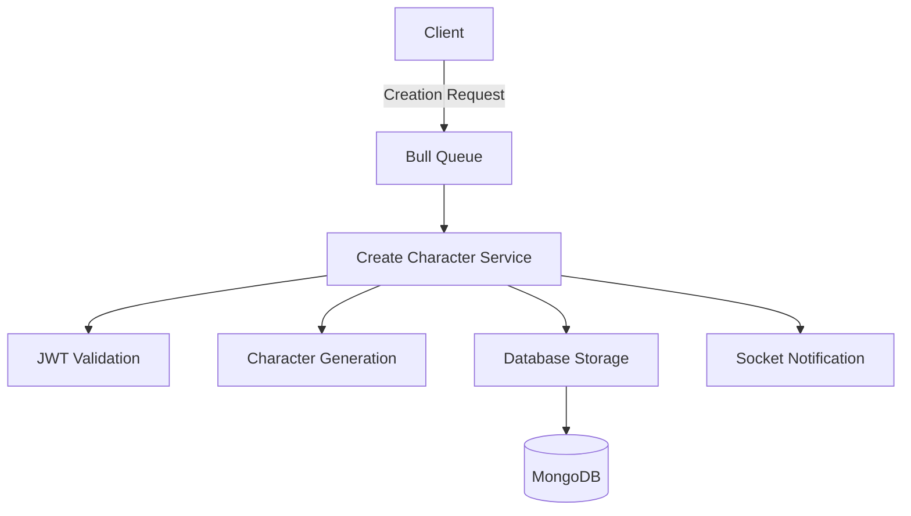

# Create Character Service

A microservice for handling character creation in the StoryBang platform.

## Architecture Diagram



## Features

- Queue-based character creation
- Real-time notifications
- JWT authentication
- Secure data storage
- Input validation
- Character template support

## Technical Stack

- Node.js
- Express
- Bull Queue
- MongoDB
- Socket.IO
- Redis
- JWT Authentication

## Environment Setup

```env
PORT=4016
PORT_MESSAGES_USERS=4003
MONGODB_URI=mongodb://localhost:27017/storybang
REDIS_HOST=localhost
REDIS_PORT=6379
JWT_SECRET=your_secret_key
```

## API Structure

### Queue Job Data Format
```typescript
interface CreateCharacterJob {
    Id: string;           // User ID
    Token: string;        // JWT token
    CharacterData: {
        name: string;
        type: string;
        attributes: object;
        description: string;
    }
}
```

### Response Format
```typescript
interface CreateResponse {
    success: boolean;
    message: string;
    character?: object;
}
```

## Installation

1. Install dependencies:
```bash
npm install
```

2. Configure Redis:
```bash
redis-server
```

3. Start service:
```bash
npm start
```

## Service Flow

1. Receives creation request through Bull Queue
2. Validates JWT token
3. Processes character data
4. Generates unique character ID
5. Stores in database
6. Sends confirmation notification

## Directory Structure

```
Create_Character/
├── Config/
│   └── redis.config.js
├── Database/
│   └── connect.js
├── Services/
│   ├── create.service.js
│   ├── notification.service.js
│   └── jwt.service.js
├── Models/
│   └── character.model.js
├── server.js
├── .env
└── README.md
```

## Error Handling

- Invalid token errors
- Duplicate character names
- Database connection issues
- Invalid character data
- Queue processing errors

## Character Model

```javascript
{
    userId: String,
    name: String,
    type: String,
    attributes: Object,
    description: String,
    createdAt: Date,
    updatedAt: Date,
    status: String
}
```

## Security Measures

- JWT validation
- Input sanitization
- Rate limiting
- Data encryption
- Access control

## Testing

Run tests with:
```bash
npm test
```

Test coverage includes:
- Character creation
- Token validation
- Data validation
- Error handling

## Monitoring

Service monitoring includes:
- Queue status
- Creation metrics
- Error logging
- Performance tracking

## Contributing

1. Fork repository
2. Create feature branch
3. Implement changes
4. Submit pull request

## Best Practices

- Input validation
- Error logging
- Queue monitoring
- Database indexing
- Cache management