# Delete Character Service

The Delete Character service is a microservice component for removing character data in the StoryBang platform.

## System Architecture

```mermaid
graph TD
    A[Client] -->|Delete Request| B[Bull Queue]
    B --> C[Delete Character Service]
    C --> D[JWT Validation]
    C --> E[Database Operation]
    C --> F[Socket Notification]
    E --> G[(MongoDB)]
```



## Features

- Queue-based character deletion
- JWT authentication validation
- Real-time operation status notifications
- Secure deletion confirmation
- Audit logging of deletions

## Technical Requirements

- Node.js >= 18
- Redis server
- MongoDB
- Socket.IO
- Bull Queue

## Configuration

### Environment Variables
```env
PORT=4015
PORT_MESSAGES_USERS=4003
MONGODB_URI=mongodb://localhost:27017/storybang
REDIS_HOST=localhost
REDIS_PORT=6379
JWT_SECRET=your_secret_key
```

## API Structure

### Queue Job Payload
```typescript
interface DeleteJobData {
    Id: string;         // User ID
    Token: string;      // JWT token
    CharacterId: string // Character to delete
}
```

### Response Format
```typescript
interface DeleteResponse {
    success: boolean;
    message: string;
    deletedCharacter?: object;
}
```

## Installation and Setup

1. **Install Dependencies**
```bash
npm install
```

2. **Start Redis Server**
```bash
redis-server
```

3. **Launch Service**
```bash
npm start
```

## Service Components

### Main Server Structure
````javascript
import express from "express";
import Queue from "bull";
import { io } from "socket.io-client";
import { DeleteCharacterService } from "./Services/delete.service.js";
import { JWTService } from "./Services/jwt.service.js";

const deleteQueue = new Queue("Delete_Character", redisOptions);
const deleteService = new DeleteCharacterService();
const jwtService = new JWTService();
````

## Error Handling

The service handles various error scenarios:
- Invalid JWT tokens
- Character not found
- Unauthorized deletion attempts
- Database connection issues
- Queue processing failures

## Directory Structure
```
Delete_Character/
├── Config/
│   └── redis.config.js
├── Database/
│   └── connect.js
├── Services/
│   ├── delete.service.js
│   ├── notification.service.js
│   └── jwt.service.js
├── server.js
├── .env
└── README.md
```

## Service Flow

1. Receives delete request via Bull Queue
2. Validates JWT token
3. Checks user permissions
4. Executes character deletion
5. Sends confirmation notification
6. Logs deletion event

## Testing

Run the test suite:
```bash
npm test
```

Example test cases:
- Valid character deletion
- Invalid token handling
- Non-existent character
- Permission validation

## Security Measures

- JWT validation for all requests
- User permission verification
- Audit logging of deletions
- Secure database operations

## Monitoring

The service provides monitoring through:
- Queue status metrics
- Operation logs
- Real-time socket notifications
- Error tracking

## Contributing

1. Fork the repository
2. Create feature branch (`git checkout -b feature/DeleteFeature`)
3. Commit changes (`git commit -m 'Add DeleteFeature'`)
4. Push to branch (`git push origin feature/DeleteFeature`)
5. Create Pull Request