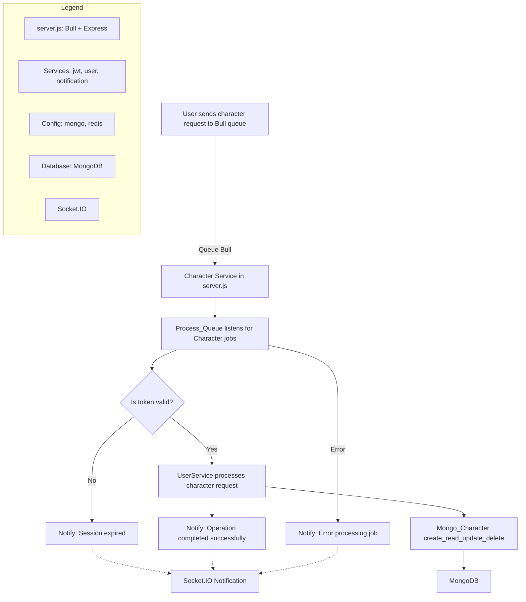

# Character Creator Microservices Overview

This directory contains the microservices for character management in the Proyecto Octavo platform. Each folder represents a specialized service for creating, reading, or deleting character data. All services are containerized for easy deployment and integration, and follow a queue-based, event-driven architecture.

---

## Flowchart of the Character Module

This flowchart represents the general architecture of the character module, not just for character creation but also for reading, updating, and deleting characters. All these operations follow the same structure using Bull queues, JWT authentication, MongoDB for persistence, and real-time notifications through Socket.IO.

## Folder Summaries

### Create_Character

**Purpose:**  
Handles the creation of new character profiles for users.

**Key Features:**
- Receives character creation requests via a Bull queue.
- Verifies JWT tokens for authentication.
- Stores character data (name, description, images, user ID) in MongoDB.
- Sends real-time notifications to users via Socket.IO.
- Robust error handling for authentication, validation, and database operations.
- Includes unit tests with Jest and is Dockerized for deployment.

---

### Read_Character

**Purpose:**  
Retrieves character information for users, supporting filtered queries.

**Key Features:**
- Processes read requests through a Bull queue.
- Verifies JWT tokens for secure access.
- Fetches character data from MongoDB, supporting filters and sorting (e.g., most recent characters).
- Sends results or error notifications to users via Socket.IO.
- Comprehensive error handling for authentication, database, and queue issues.
- Includes unit tests with Jest and is Dockerized for deployment.

---

### Delete_Character

**Purpose:**  
Manages the secure and asynchronous deletion of character profiles.

**Key Features:**
- Processes deletion requests via a Bull queue.
- Verifies JWT tokens for authentication.
- Deletes character data from MongoDB by character ID.
- Notifies users of operation results in real time via Socket.IO.
- Handles errors for authentication, database, and queue processing.
- Includes unit tests with Jest and is Dockerized for deployment.

---

## General Notes

- All services use environment variables for configuration (MongoDB, Redis, JWT, etc.).
- Each service is stateless, modular, and horizontally scalable.
- Security best practices are followed, including JWT authentication and secure error handling.
- Each folder contains its own `README.md` with further details and usage instructions.

---
