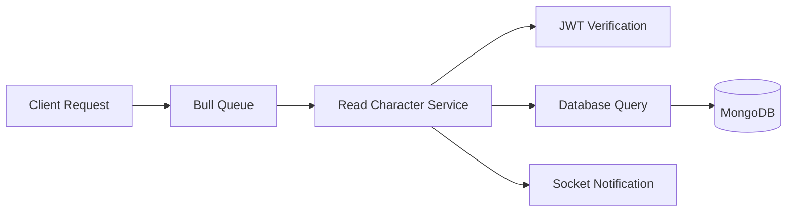

# Read Character Service

This microservice is part of the StoryBang character management system, responsible for retrieving character information from the database.

## Overview

The Read Character service is built using Node.js and Express, implementing a queue-based architecture with Bull for job processing and Redis for queue management.

## Architecture



## Features

- Queue-based job processing
- JWT authentication
- Real-time notifications via Socket.IO
- MongoDB database integration
- Redis queue management

## Technical Stack

- Node.js
- Express
- Bull Queue
- Socket.IO
- MongoDB
- Redis
- JSON Web Tokens (JWT)

## Configuration

### Environment Variables

```env
PORT=4007
PORT_MESSAGES_USERS=4003
MONGODB_URI=mongodb://localhost:27017/storybang
REDIS_HOST=localhost
REDIS_PORT=6379
JWT_SECRET=your_secret_key
```

## API Structure

### Queue Job Data Format

```javascript
{
  Id: "user_id",
  Token: "jwt_token",
  Filter: "character_filter_criteria"
}
```

### Response Format

```javascript
{
  success: boolean,
  message: string | object
}
```

## Installation

1. Install dependencies:
```bash
npm install
```

2. Start Redis server:
```bash
redis-server
```

3. Start the service:
```bash
npm start
```

## Service Flow

1. Receives character read requests through Bull Queue
2. Validates JWT token
3. Processes character filter criteria
4. Queries database for character information
5. Sends real-time notification with results via Socket.IO

## Dependencies

```json
{
  "express": "^4.18.x",
  "bull": "^4.x.x",
  "dotenv": "^16.x.x",
  "socket.io-client": "^4.x.x",
  "mongodb": "^5.x.x",
  "jsonwebtoken": "^9.x.x"
}
```

## Error Handling

The service implements comprehensive error handling:
- JWT validation errors
- Database connection issues
- Invalid filter criteria
- Queue processing errors

## Services

### NotificationService
Handles real-time notifications through Socket.IO

### UserService
Manages character-related database operations

### JWTService
Handles token verification and authentication

## Contributing

1. Fork the repository
2. Create feature branch (`git checkout -b feature/YourFeature`)
3. Commit changes (`git commit -m 'Add YourFeature'`)
4. Push to branch (`git push origin feature/YourFeature`)
5. Open Pull Request

## Directory Structure

```
Read_Character/
├── Config/
│   └── redis.config.js
├── Database/
│   └── connect.js
├── Services/
│   ├── notification.service.js
│   ├── user.service.js
│   └── jwt.service.js
├── server.js
├── .env
└── README.md
```

