# GPT-2 Story Generator API

This project is a RESTful API built with Flask that uses a custom-trained GPT-2 model to generate stories for different audiences. The service is containerized with Docker and ready for deployment.

## Flowchart of the Story Generation Module

This flowchart illustrates the architecture and flow of the story generation module. It handles HTTP POST requests with a JSON payload containing a prompt and audience data. The module uses a Flask application that initializes two main components: the GPT2StoryGenerator service responsible for generating stories using a GPT-2 model, and the StoryController that manages the API route logic.

The process begins with the `/generate_story` route handler validating the presence of a prompt in the request. If no prompt is provided, an error response is returned. Otherwise, the story generator proceeds by tokenizing the prompt, selecting generation parameters based on the audience, generating the story, and formatting the output into a Story object.

Finally, the module returns a JSON response indicating success or failure along with the generated story content when successful.

The module architecture is divided into infrastructure, API, and domain layers, each responsible for specific tasks and implemented in their corresponding source files as detailed in the legend.


Aquí tienes el diagrama completamente **traducido al español y adaptado para un `README.md` de GitHub** en formato Markdown, manteniendo la sintaxis `mermaid`:

---

## 🧠 Flujo de Generación de Historia (API Flask con GPT2)

```mermaid
flowchart TD
    %% Inicio del flujo
    A[Usuario envía solicitud POST para generar historia\ncon datos JSON] --> B[Aplicación Flask main.py]

    %% Inicialización de servicios y controlador
    B --> C[Generador GPT2 de Historia\nsrc/infrastructure/gpt2_story_generator.py]
    B --> D[Controlador de Historia\nsrc/api/story_controller.py]

    %% Ruta principal
    D --> E[Manejador de ruta para generar historia]

    %% Lógica del controlador
    E --> F{¿Existe el prompt?}
    F -- No --> G[Error: no se proporcionó prompt\nRetorna JSON de error]
    F -- Sí --> H[Generador de historia genera usando prompt y audiencia]

    %% Lógica de generación
    H --> I[Tokeniza el prompt]
    I --> J[Selecciona parámetros de generación por audiencia]
    J --> K[Genera historia con modelo GPT2]
    K --> L[Decodifica y formatea la salida]
    L --> M[Crea objeto Historia]

    %% Respuesta
    M --> N{Estado de la historia}
    N -- False --> O[Retorna JSON de error]
    N -- True --> P[Retorna JSON con status true y contenido]

    %% Clases principales
    classDef infra fill:#f9f,stroke:#333,stroke-width:2px
    classDef api fill:#bfb,stroke:#333,stroke-width:2px
    classDef domain fill:#bbf,stroke:#333,stroke-width:2px
    class C infra
    class D api
    class H infra
    class M domain

    %% Leyenda
    subgraph Leyenda [Leyenda]
        direction LR
        L1[main.py: App Flask carga entorno e inicializa GPT2StoryGenerator y StoryController]
        L2[src/api/story_controller.py: lógica del controlador de rutas]
        L3[src/infrastructure/gpt2_story_generator.py: lógica de generación GPT2]
        L4[src/domain/story_generator.py: clase abstracta StoryGenerator]
        L5[src/domain/story.py: dataclass Story para la respuesta]
    end
```



---


---
## Table of Contents

- [Project Structure](#project-structure)
- [Features](#features)
- [Installation](#installation)
- [Usage](#usage)
- [API Endpoints](#api-endpoints)
- [Docker Usage](#docker-usage)
- [Configuration](#configuration)
- [Development Notes](#development-notes)

---

## Project Structure

```
Back/Generator/Gpt2_Text_Generator/
│
├── main.py                  # Entry point for the Flask API
├── requirements.txt         # Python dependencies
├── Dockerfile               # Docker build instructions
├── docker-compose.yml       # Docker Compose configuration
├── .gitignore
├── .dockerignore
│
├── src/
│   ├── api/
│   │   └── story_controller.py      # API routes and controller logic
│   ├── domain/
│   │   ├── story.py                 # Story entity definition
│   │   └── story_generator.py       # Abstract base for story generators
│   └── infrastructure/
│       └── gpt2_story_generator.py  # GPT-2 implementation of story generator
│
└── story_model/             # Directory containing the trained GPT-2 model and configs
    ├── config.json
    ├── generation_config.json
    ├── merges.txt
    ├── model.safetensors
    ├── optimizer.pt
    ├── rng_state.pth
    ├── scheduler.pt
    ├── special_tokens_map.json
    ├── tokenizer_config.json
    ├── tokenizer.json
    ├── trainer_state.json
    ├── training_args.bin
    └── vocab.json
```

---

## Features

- **REST API** for story generation using GPT-2.
- Supports different audience types (children, young, adult) with custom generation parameters.
- Modular and extensible codebase using SOLID principles.
- Dockerized for easy deployment.
- CORS enabled for cross-origin requests.

---

## Installation

### Prerequisites

- Python 3.10+
- [pip](https://pip.pypa.io/en/stable/)
- (Optional) [Docker](https://www.docker.com/)

### Steps

1. **Clone the repository:**
   ```sh
   git clone <repository-url>
   cd Back/Generator/Gpt2_Text_Generator
   ```

2. **Install dependencies:**
   ```sh
   pip install -r requirements.txt
   ```

3. **Download or place your trained GPT-2 model files in the `story_model/` directory.**

---

## Usage

### Run Locally

```sh
python main.py
```

The API will be available at [http://localhost:4019](http://localhost:4019).

---

## API Endpoints

### `POST /generate_story`

**Description:**  
Generates a story based on a prompt and audience type.

**Request Body (JSON):**
```json
{
  "Prompt": "Once upon a time in a distant land...",
  "Audience": "children"
}
```

**Response (Success):**
```json
{
  "Status": true,
  "Content": "[Content]: Once upon a time in a distant land... (generated story)"
}
```

**Response (Error):**
```json
{
  "error": "No prompt provided"
}
```

---

## Docker Usage

### Build and Run with Docker Compose

```sh
docker-compose up --build
```

- The service will be available at port `4019` by default.

### Dockerfile Highlights

- Uses `python:3.10-slim` as the base image.
- Installs PyTorch and Transformers.
- Exposes port `4019`.

---

## Configuration

- **Model Checkpoint:**  
  The GPT-2 model and tokenizer files must be placed in the `story_model/` directory.
- **Port:**  
  The default port is `4019`. You can change this in `main.py` or in the Docker Compose file.

---

## Development Notes

- The code follows SOLID principles:
  - **Single Responsibility:** Each module/class has a clear responsibility.
  - **Open/Closed:** Easily extendable for new models or controllers.
  - **Dependency Inversion:** Controllers depend on abstract interfaces, not concrete implementations.
- To add a new story generator, implement the `StoryGenerator` abstract class in `src/domain/story_generator.py`.

