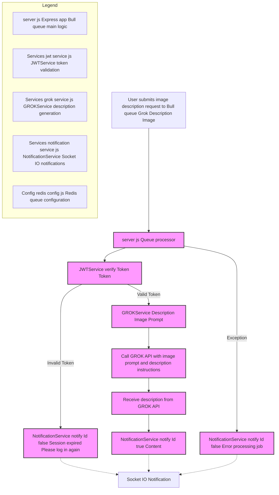

# GROK Image Description Service

## General Description
This service is part of a microservices architecture that generates image descriptions using GROK technology. It implements a queue-based system to process image description requests with JWT authentication.

## Flowchart of the Image Description Generation Module

This flowchart describes the process for generating image descriptions using a Bull queue named "Grok Description Image". When a user submits an image description request, the system validates the user's token via JWTService. If the token is invalid, a notification is sent to the user informing them the session expired. If valid, the GROKService processes the prompt to generate the description by calling the GROK API.

The description returned by the GROK API is then sent back to the user via NotificationService and Socket.IO real-time notifications. Any errors during processing are also communicated through notifications.

The module is structured into key components including the Express app with Bull queue processing, JWT token validation, GROK description generation, notification handling, and Redis queue configuration, as detailed in the legend.



## Technologies Used
- Express.js - Web framework
- Bull - Queue management
- Socket.io - Real-time notifications
- Redis - Queue backend
- JWT - Authentication
- GROK - Image description generation
- Jest - Unit testing

## Features
- Asynchronous image description generation using a queue system
- JWT-based authentication
- Real-time job status notifications
- Error handling and session management
- Comprehensive unit test coverage

## Environment Variables
```env
PORT=<server_port>
PORT_MESSAGES_USERS=<notification_service_port>
GROK_API_KEY=<your_grok_api_key>
GROK_API_URL=<grok_api_endpoint>
```

## Request Schema
```json
{
    "Token": "string (JWT token)",
    "Prompt": "string (image to describe)",
    "Id": "string (unique identifier for notification)"
}
```

## Response Schema
```json
{
    "success": "boolean",
    "data": {
        "description": "string (generated image description)"
    },
    "error": "string (error message if any)"
}
```

## Unit Tests
The service includes comprehensive unit tests using Jest. The tests cover:
- Token validation
- Queue processing
- Description generation
- Error handling
- WebSocket notifications

To run tests:
```bash
npm test
```

## Error Handling
- Session expiration notifications
- Processing error notifications
- Queue process error management

## Dependencies
- express
- bull
- dotenv
- socket.io-client
- jest (development dependency)

## Services Used
- NotificationService - Handles WebSocket notifications
- JWTService - Manages token validation
- GROKService - Handles description generation
- Redis - Queue management configuration

## Usage
The service listens for image description requests and processes them through a Bull queue. Each request must include:
- Valid JWT token
- Image to describe

Responses are sent to the client via WebSocket notifications.