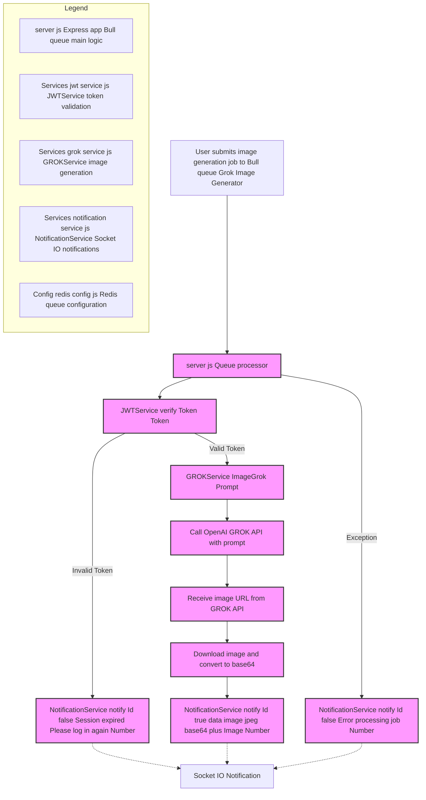

# GROK Image Generator Service
          
# Image Generator Service

## Overview
This service is part of a microservices architecture that generates images based on user prompts using GROK technology. It implements a queue-based system for processing image generation requests with JWT authentication.


## Flowchart of the Image Generation Module

This flowchart describes the image generation process using the Bull queue named "Grok Image Generator". When a user submits a request, it is handled by the server.js queue processor.

The JWTService validates the provided token. If the token is invalid, the NotificationService informs the user that the session has expired. If the token is valid, the GROKService triggers a call to the OpenAI GROK API using the given prompt to generate the image.

After receiving the image URL, the server downloads the image and converts it to base64 format. This result is sent to the user as a success notification. All notifications are also transmitted through Socket.IO in real time. Any exception in the process also triggers an error notification.



## Technologies Used
- Express.js - Web framework
- Bull - Queue management
- Socket.io - Real-time notifications
- Redis - Queue backend
- JWT - Authentication
- GROK - Image generation
- Jest - Unit testing

## Features
- Asynchronous image generation using queue system
- JWT-based authentication
- Real-time notifications for job status
- Error handling and session management
- Comprehensive unit test coverage

## Environment Variables
```env
PORT=<server_port>
PORT_MESSAGES_USERS=<notification_service_port>
GROK_API=<grok_api_endpoint>
```

## Queue Process Flow
1. Receives job with Token and Prompt data
2. Validates JWT token
3. Generates image using GROK service
4. Notifies user of success/failure through WebSocket

## Request Schema
```json
{
    "Token": "string (JWT token)",
    "Prompt": "string (image generation prompt)",
    "Id": "string (unique identifier for notification)"
}
```

## Response Schema
```json
{
    "success": "boolean",
    "data": {
        "image": "string (base64 encoded image)"
    },
    "error": "string (error message if any)"
}
```

## Unit Testing
The service includes comprehensive unit tests using Jest framework. Tests cover:
- Token validation
- Queue processing
- Image generation
- Error handling
- WebSocket notifications

To run tests:
```bash
npm test
```

## Error Handling
- Session expiration notifications
- Job processing error notifications
- Queue process error management

## Dependencies
- express
- bull
- dotenv
- socket.io-client
- jest (dev dependency)

## Services Used
- NotificationService - Handles WebSocket notifications
- JWTService - Manages token validation
- GROKService - Handles image generation
- Redis - Queue management configuration

## Usage
The service listens for image generation requests and processes them through a Bull queue. Each request must include:
- Valid JWT token
- Image generation prompt

Responses are sent back to the client through WebSocket notifications.
        