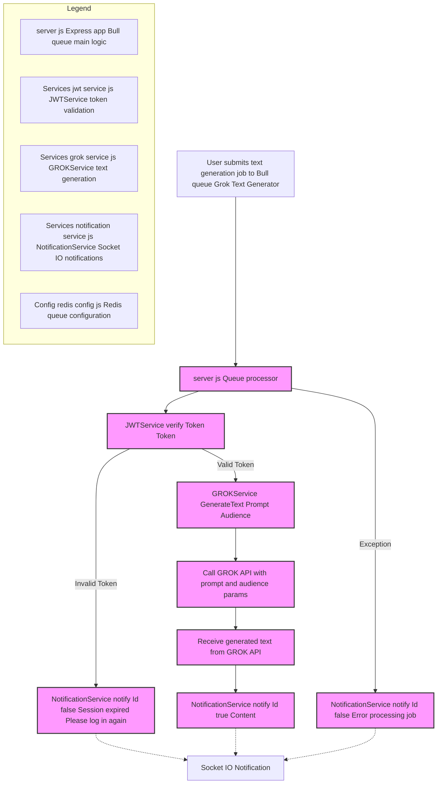

# GROK Text Generator Service

## Overview
This service is part of a microservices architecture that generates text content using GROK technology. It implements a queue-based system for processing text generation requests with JWT authentication.

## Flowchart of the Text Generation Module

This flowchart illustrates the workflow for the text generation feature using the Bull queue named "Grok Text Generator". When a user submits a text generation job, the request is processed by the server's queue processor.

The JWTService validates the user's token. If the token is invalid, the user is notified that the session expired. If valid, the GROKService generates the text based on the provided prompt and audience parameters by calling the GROK API.

The generated text is then sent back to the user via NotificationService with real-time updates through Socket.IO. Errors during job processing trigger notifications as well.

The key components include the Express server with Bull queue handling, JWT token validation, GROK text generation service, notification service, and Redis queue configuration as outlined in the legend.



## Technologies Used
- Express.js - Web framework
- Bull - Queue management
- Socket.io - Real-time notifications
- Redis - Queue backend
- JWT - Authentication
- GROK - Text generation
- Jest - Unit testing

## Features
- Asynchronous text generation using queue system
- JWT-based authentication
- Real-time notifications for job status
- Error handling and session management
- Comprehensive unit test coverage

## Environment Variables
```env
PORT=<server_port>
PORT_MESSAGES_USERS=<notification_service_port>
GROK_API_KEY=<your_grok_api_key>
GROK_API_URL=<grok_api_endpoint>
```

## Queue Process Flow
1. Receives job with Token and Prompt data
2. Validates JWT token
3. Generates text content using GROK service
4. Notifies user of success/failure through WebSocket

## Request Schema
```json
{
    "Token": "string (JWT token)",
    "Prompt": "string (text generation prompt)",
    "Id": "string (unique identifier for notification)"
}
```

## Response Schema
```json
{
    "success": "boolean",
    "data": {
        "content": "string (generated text)"
    },
    "error": "string (error message if any)"
}
```

## Unit Testing
The service includes comprehensive unit tests using Jest framework. Tests cover:
- Token validation
- Queue processing
- Text generation
- Error handling
- WebSocket notifications

To run tests:
```bash
npm test
```

## Error Handling
- Session expiration notifications
- Job processing error notifications
- Queue process error management

## Dependencies
- express
- bull
- dotenv
- socket.io-client
- jest (dev dependency)

## Services Used
- NotificationService - Handles WebSocket notifications
- JWTService - Manages token validation
- GROKService - Handles text generation
- Redis - Queue management configuration

## Usage
The service listens for text generation requests and processes them through a Bull queue. Each request must include:
- Valid JWT token
- Text generation prompt

Responses are sent back to the client through WebSocket notifications.
        