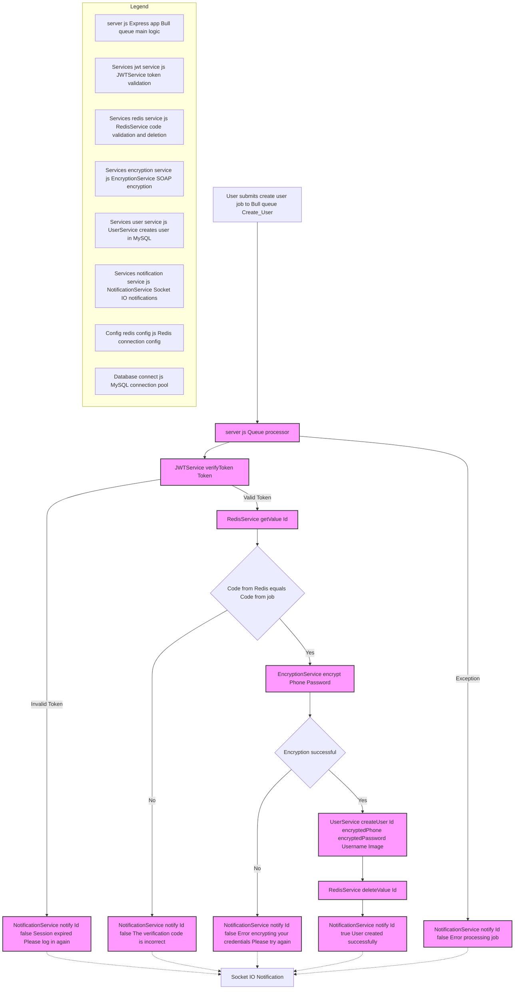

# Create_User Microservice

## Description
The Create_User microservice is responsible for handling user registration in the system. It implements an asynchronous processing approach using Bull queues and integrates with multiple services for secure user creation.

## Create User Flow - Bull Queue + Redis + MySQL



## Features
- Asynchronous user creation using Bull queues
- JWT token verification
- Redis-based verification code validation
- Secure credential encryption
- Real-time notifications via Socket.IO
- Database integration for user storage

## Technologies Used
- Node.js
- Express.js
- Bull (for queue processing)
- Redis
- Socket.IO (client)
- JSON Web Tokens (JWT)

## Main Dependencies
```json
{
  "express": "For HTTP server implementation",
  "bull": "For queue processing",
  "socket.io-client": "For real-time notifications",
  "dotenv": "For environment variable management"
}
```

## Configuration
The service requires the following environment variables:
- `PORT`: Service port number
- `PORT_MESSAGES_USERS`: Socket.IO server port for user notifications
- `PORT_ENCRYPT`: Port for the encryption service

## Integrated Services
1. **Redis Service**: Manages verification codes
2. **Encryption Service**: Handles secure encryption of user credentials
3. **Notification Service**: Provides real-time updates via Socket.IO
4. **User Service**: Handles database operations
5. **JWT Service**: Manages token verification

## Workflow
1. Receives user creation request through Bull queue
2. Verifies JWT token
3. Validates verification code from Redis
4. Encrypts user credentials (phone and password)
5. Creates user in database
6. Sends real-time notification of operation result

## Error Handling
- Invalid JWT token handling
- Incorrect verification code management
- Encryption service errors
- Queue processing errors
- Real-time error notifications

## Installation and Execution

### Local Development
1. Install dependencies:
```bash
npm install
```

2. Set up environment variables in `.env` file

3. Start the service:
```bash
npm start
```

### Docker Deployment
1. Build the image:
```bash
docker build -t create-user-service .
```

2. Run the container:
```bash
docker-compose up
```

## Testing
The service includes Jest-based tests. Run them using:
```bash
npm test
```

## Project Structure
```
Create_User/
├── Config/
│   └── redis.config.js
├── Controllers/
│   └── test_connection.js
├── Database/
│   └── connect.js
├── Services/
│   ├── encryption.service.js
│   ├── jwt.service.js
│   ├── notification.service.js
│   ├── redis.service.js
│   └── user.service.js
├── __tests__/
├── server.js
└── docker-compose.yml
```

## Contributing
1. Fork the repository
2. Create a feature branch
3. Commit your changes
4. Push to the branch
5. Create a Pull Request

## Security Considerations
- Implements JWT-based authentication
- Encrypts sensitive user data
- Uses secure Redis connections
- Implements proper error handling and validation

## Development Notes
- Ensure Redis server is running
- Configure all required environment variables
- Test queue processing before deployment
- Monitor Socket.IO connections for real-time notifications
        