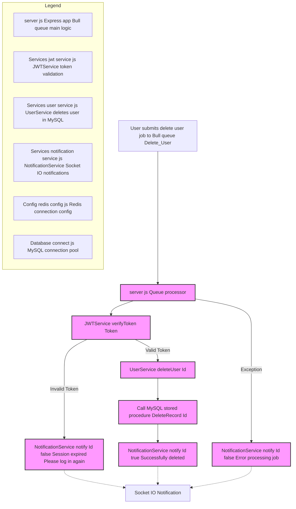

# Delete User Microservice

A microservice for handling user deletion operations using Bull queue for job processing and real-time notifications.

## Delete User Flow - Bull Queue + MySQL




## Features

- Asynchronous user deletion using Bull queue
- JWT token verification
- Real-time notifications via Socket.IO
- Error handling and session validation
- Database integration

## Technologies

- Node.js
- Express.js
- Bull (Redis-based queue)
- Socket.IO
- JSON Web Tokens (JWT)

## Dependencies

```json
{
  "express": "Web framework",
  "bull": "Queue management",
  "dotenv": "Environment configuration",
  "socket.io-client": "Real-time communication"
}
```

## Configuration

The service uses environment variables for configuration:

```env
PORT                  # Service port number
PORT_MESSAGES_USERS   # Socket.IO server port for notifications
```

Additional configuration files:
- `Config/redis.config.js`: Redis connection options
- `Database/connect.js`: Database connection configuration

## Services

### 1. NotificationService
Handles real-time notifications to clients using Socket.IO

### 2. UserService
Manages user deletion operations in the database

### 3. JWTService
Handles JWT token verification

## Queue Processing

The service uses a Bull queue named "Delete_User" for processing deletion requests:

1. Verifies JWT token validity
2. Deletes user if token is valid
3. Sends real-time notification about operation status

### Job Data Structure

```javascript
{
    Token: "jwt_token",
    Id: "user_id"
}
```

## Error Handling

The service handles various scenarios:

- Invalid/expired JWT tokens
- Database operation failures
- General processing errors

All errors are communicated back to the client via Socket.IO notifications.

## Running the Service

1. Install dependencies:
   ```bash
   npm install
   ```

2. Set up environment variables in `.env`

3. Start the service:
   ```bash
   npm start
   ```

The service will be available at `http://localhost:{PORT}`

## Docker Support

The service includes Docker configuration files:
- `Dockerfile`
- `docker-compose.yml`
- `.dockerignore`

## Testing

The service includes Jest configuration for testing:
- `jest.config.js`
- `babel.config.json`

Run tests with:
```bash
npm test
```

## Project Structure

```
├── Config/           # Configuration files
├── Controllers/      # Request handlers
├── Database/         # Database connection and models
├── Services/         # Business logic services
├── __tests__/        # Test files
├── server.js         # Main application file
└── package.json      # Project metadata and dependencies
```

## Contributing

1. Fork the repository
2. Create your feature branch
3. Commit your changes
4. Push to the branch
5. Create a new Pull Request

## Security Considerations

1. Ensure secure environment variables in production
2. Implement rate limiting for production use
3. Use secure Redis configuration
4. Monitor queue performance and failures
5. Implement proper logging for production environments
```