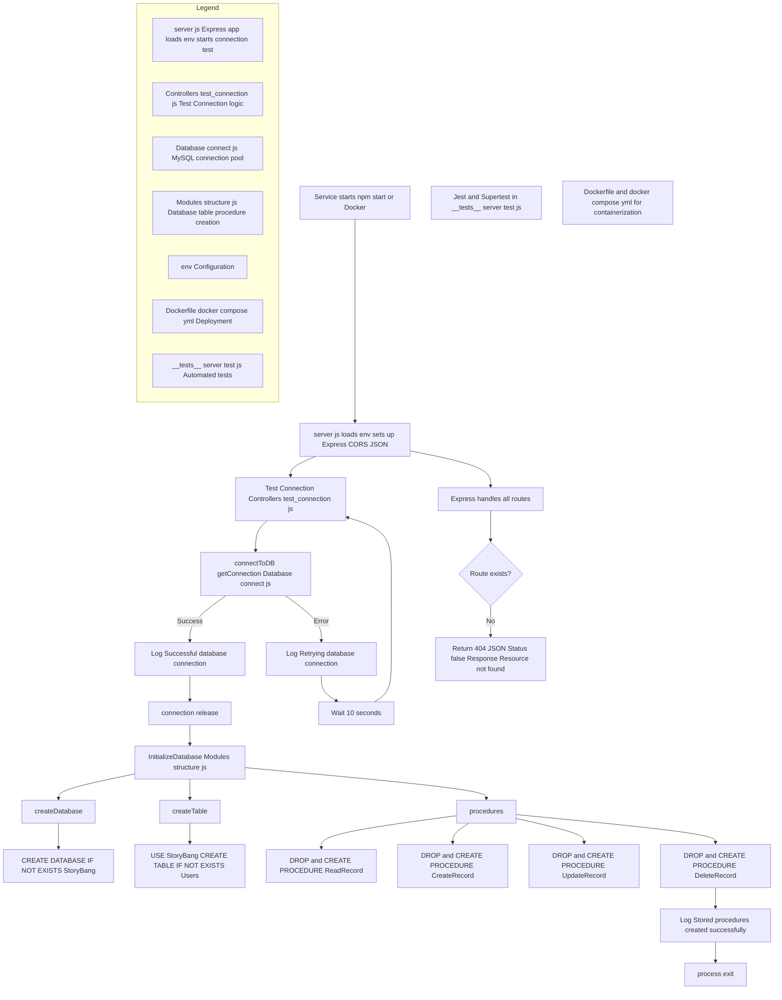

```markdown
# Mysql_Structure Microservice

## Description
The Mysql_Structure microservice is a Node.js service designed to manage MySQL database connections and structure. It provides an abstraction layer for connection management and database status verification.

## Service Architecture and Startup Flow



## Features
- MySQL connection verification
- HTTP error handling
- CORS support
- Environment variable configuration
- Test mode for testing

## Technologies Used
- Node.js
- Express.js
- CORS
- dotenv
- MySQL (for database connection)

## Main Dependencies
```json
{
  "express": "^4.x.x",
  "cors": "^2.x.x",
  "dotenv": "^16.x.x"
}
```

## Configuration
1. Create a `.env` file in the project root:
```plaintext
PORT=3000
DB_HOST=localhost
DB_USER=usuario
DB_PASSWORD=contraseña
DB_DATABASE=nombre_base_datos
```

## Project Structure
```
Mysql_Structure/
├── Controllers/
│   └── test_connection.js    # Controller for connection testing
├── Database/                 # Database configuration
├── Modules/                  # Additional modules
├── __tests__/               # Unit tests
├── .env                     # Environment variables
├── server.js                # Main entry point
├── Dockerfile               # Docker configuration
└── docker-compose.yml       # Docker Compose configuration
```

## Endpoints
- **404 Not Found**
  - Default response for undefined routes
  - Returns: `{ Status: false, Response: "Resource not found" }`

## Installation and Execution

### Local
1. Install dependencies:
   ```bash
   npm install
   ```

2. Start the server:
   ```bash
   npm start
   ```

### Docker
1. Build the image:
   ```bash
   docker build -t mysql-structure .
   ```

2. Run with Docker Compose:
   ```bash
   docker-compose up
   ```

## Testing
- The service includes Jest configuration for testing
- Run tests with:
   ```bash
   npm test
   ```

## Development Features
- CORS middleware configured for cross-origin requests
- Built-in JSON handling
- Automatic database connection verification on startup
- Separate test mode (NODE_ENV=test)

## Security
- CORS implementation for access control
- Sensitive variables managed through environment variables
- Generic error messages to prevent sensitive information exposure

## Contribution
1. Fork the repository
2. Create a feature branch (`git checkout -b feature/AmazingFeature`)
3. Commit your changes (`git commit -m 'Add some AmazingFeature'`)
4. Push to the branch (`git push origin feature/AmazingFeature`)
5. Open a Pull Request

## Development Notes
- Designed to be part of a microservices architecture
- Performs connection verification on service startup
- Includes standard HTTP error handling
- Flexible configuration via environment variables
```