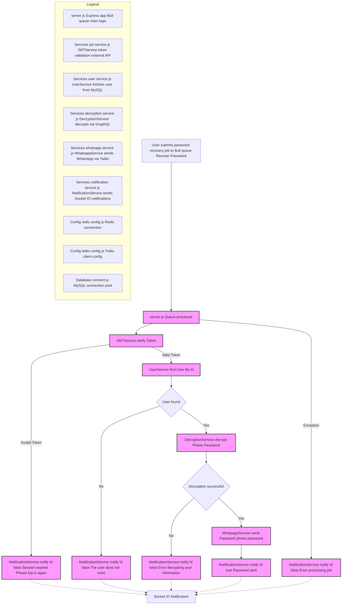

# Password_Recovery Microservice

## Description
The Password_Recovery microservice is a password recovery system that uses Bull Queue for processing recovery requests, secure decryption, and password delivery via WhatsApp.

## Password Recovery Job Flow



## Features
- Asynchronous request processing using Bull Queue
- JWT token verification
- Secure decryption of user data
- Password delivery via WhatsApp using Twilio
- Real-time notifications using Socket.IO
- Database integration

## Technologies Used
- Node.js
- Express.js
- Bull (for job queues)
- Socket.IO (for real-time notifications)
- Twilio (for WhatsApp messaging)
- Redis (for Bull Queue)
- JWT (for authentication)

## Integrated Services
- NotificationService: Handles real-time notifications
- UserService: Manages user data and database queries
- DecryptionService: Decrypts sensitive data
- WhatsappService: Sends messages via WhatsApp
- JWTService: Verifies tokens

## Configuration
1. Create a `.env` file in the project root:
```plaintext
PORT=3000
PORT_MESSAGES_USERS=3001
PORT_DECRYPT=3002

# Twilio Configuration
TWILIO_ACCOUNT_SID=your_account_sid
TWILIO_AUTH_TOKEN=your_auth_token
TWILIO_WHATSAPP_FROM=whatsapp:+1234567890

# Redis Configuration
REDIS_HOST=localhost
REDIS_PORT=6379

# Database Configuration
DB_HOST=localhost
DB_USER=usuario
DB_PASSWORD=contraseña
DB_DATABASE=nombre_base_datos
```

## Project Structure
```
Password_Recovery/
├── Config/
│   ├── redis.config.js
│   └── twilio.config.js
├── Controllers/
│   └── test_connection.js
├── Database/
│   └── connect.js
├── Services/
│   ├── notification.service.js
│   ├── user.service.js
│   ├── decryption.service.js
│   ├── whatsapp.service.js
│   └── jwt.service.js
├── __tests__/
├── server.js
├── Dockerfile
└── docker-compose.yml
```

## Workflow
1. Receive password recovery request
2. Verify JWT token
3. Retrieve user from database
4. Decrypt phone and password
5. Send password via WhatsApp
6. Notify user of the result

## Error Handling
- Expired or invalid session/token
- User not found
- Decryption errors
- WhatsApp sending errors
- General processing errors

## Installation and Execution

### Local
1. Install dependencies:
   ```bash
   npm install
   ```

2. Start the server:
   ```bash
   npm start
   ```

### Docker
1. Build the image:
   ```bash
   docker build -t password-recovery .
   ```

2. Run with Docker Compose:
   ```bash
   docker-compose up
   ```

## Testing
```bash
npm test
```

## Security
- JWT token verification
- Secure decryption of sensitive data
- Environment variables for sensitive configurations
- Secure password handling

## Contribution
1. Fork the repository
2. Create a feature branch (`git checkout -b feature/AmazingFeature`)
3. Commit your changes (`git commit -m 'Add some AmazingFeature'`)
4. Push to the branch (`git push origin feature/AmazingFeature`)
5. Open a Pull Request

## Development Notes
- Implements queue pattern for asynchronous processing
- Uses modular services for better maintainability
- Integrates with multiple external services
- Robust error handling and notification system
```