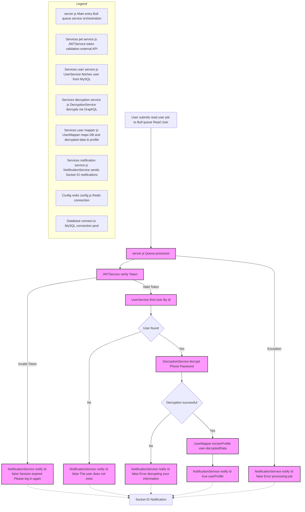

```markdown
# Read_User Microservice

## Description
The Read_User microservice is a system for reading and retrieving user profiles, implementing a Bull Queue system for asynchronous request processing. The service includes secure decryption of sensitive data and real-time notifications.

## Read User Job Flow



## Features
- Asynchronous processing with Bull Queue
- JWT token verification
- Secure decryption of user data
- User profile mapping
- Real-time notifications with Socket.IO
- Database integration

## Technologies Used
- Node.js
- Express.js
- Bull (for job queues)
- Socket.IO (for real-time notifications)
- Redis (for Bull Queue)
- JWT (for authentication)

## Integrated Services
- NotificationService: Handles real-time notifications
- UserService: Manages user data and database queries
- DecryptionService: Decrypts sensitive data
- UserMapper: Transforms user data
- JWTService: Verifies tokens

## Configuration
1. Create a `.env` file in the project root:
```plaintext
PORT=3000
PORT_MESSAGES_USERS=3001
PORT_DECRYPT=3002

# Redis Configuration
REDIS_HOST=localhost
REDIS_PORT=6379

# Database Configuration
DB_HOST=localhost
DB_USER=usuario
DB_PASSWORD=contraseña
DB_DATABASE=nombre_base_datos
```

## Project Structure
```
Read_User/
├── Config/
│   └── redis.config.js
├── Controllers/
│   └── test_connection.js
├── Database/
│   └── connect.js
├── Services/
│   ├── notification.service.js
│   ├── user.service.js
│   ├── decryption.service.js
│   ├── user.mapper.js
│   └── jwt.service.js
├── __tests__/
├── server.js
├── Dockerfile
└── docker-compose.yml
```

## Workflow
1. Receive user profile read request
2. Verify JWT token
3. Retrieve user from database
4. Decrypt sensitive data
5. Map user profile
6. Notify result

## Error Handling
- Expired or invalid session/token
- User not found
- Decryption errors
- General processing errors

## Installation and Execution

### Local
1. Install dependencies:
   ```bash
   npm install
   ```

2. Start the server:
   ```bash
   npm start
   ```

### Docker
1. Build the image:
   ```bash
   docker build -t read-user .
   ```

2. Run with Docker Compose:
   ```bash
   docker-compose up
   ```

## Testing
```bash
npm test
```

## Security
- JWT token verification
- Secure decryption of sensitive data
- Environment variables for sensitive configurations
- Secure handling of personal information

## Contribution
1. Fork the repository
2. Create a feature branch (`git checkout -b feature/AmazingFeature`)
3. Commit your changes (`git commit -m 'Add some AmazingFeature'`)
4. Push to the branch (`git push origin feature/AmazingFeature`)
5. Open a Pull Request

## Development Notes
- Implements queue pattern for asynchronous processing
- Uses modular services for better maintainability
- Robust error handling and notification system
- Data mapping for consistent response format
```