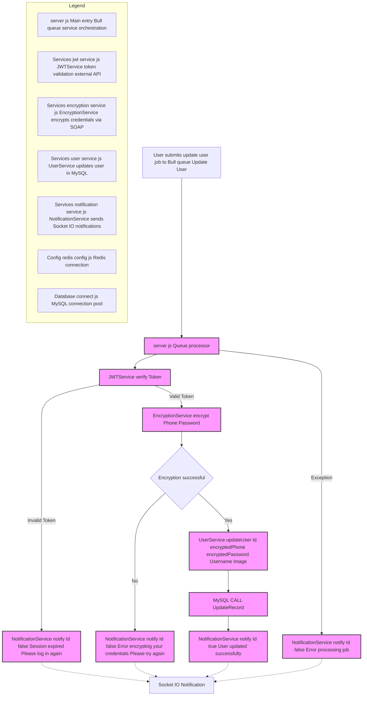

# Update User Service

This service is part of a distributed system that securely and asynchronously manages the updating of user information.

## Update User Job Flow



## Features

- Asynchronous user update processing using Bull queues.  
- Encryption of sensitive data (phone number and password).  
- JWT token validation to ensure security.  
- Real-time notifications using Socket.IO.  
- Integration with Redis for efficient queue management.

## Technologies Used

- **Node.js**  
- **Express.js**  
- **Bull** (for processing queues)  
- **Socket.IO** (for real-time notifications)  
- **Redis**  
- **JWT** (JSON Web Tokens)

## Configuration

### Environment Variables

Create a `.env` file with the following variables:

```env
PORT=<service_port>
PORT_MESSAGES_USERS=<messages_service_port>
PORT_ENCRYPT=<encryption_service_port>
Installation
npm install
Execution
npm start
Workflow
1.	The service receives user update requests through a Bull queue.
2.	It verifies the JWT token to validate the session.
3.	Encrypts sensitive data (phone number and password).
4.	Updates the user information in the database.
5.	Sends real-time notifications about the process result.
Project Structure
├── Config/
│   └── redis.config.js         # Redis configuration
├── Controllers/
│   └── test_connection.js      # Connection test
├── Database/
│   └── connect.js              # Database connection
├── Services/
│   ├── encryption.service.js   # Encryption service
│   ├── jwt.service.js          # JWT authentication service
│   ├── notification.service.js # Notification service
│   └── user.service.js         # User management service
├── .env                        # Environment variables
└── server.js                   # Main entry point
Error Handling
The service includes error handling for:
•	Invalid or expired JWT tokens.
•	Failures in the encryption process.
•	General errors during task processing.
Each error is reported to the user in real-time via Socket.IO.
Docker
The service is containerized and can be run with Docker:
docker-compose up
Testing
To run the tests:
npm test
