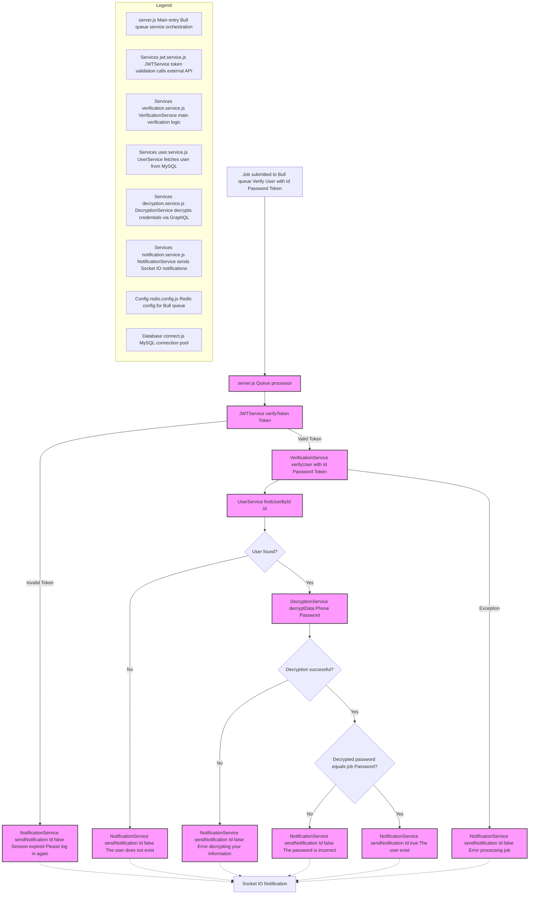

# User Verification Service

This service is part of a distributed system that manages user verification through asynchronous processing using Bull queues and secure decryption of sensitive data.



## Features

- Asynchronous verification processing via Bull  
- JWT token validation to ensure security  
- Real-time notification system for immediate feedback  
- Integration with Redis for efficient queue management  
- Secure decryption of sensitive user data

## Technologies Used

- **Node.js**  
- **Express.js**  
- **Bull** (for queue processing)  
- **Redis**  
- **JWT** (JSON Web Tokens)

## Configuration

### Environment Variables

Create a `.env` file with the following variables:

```env
PORT=<service_port>
# Additional required variables for Redis and external services
REDIS_HOST=<redis_host>
REDIS_PORT=<redis_port>
JWT_SECRET=<jwt_secret_key>
ENCRYPTION_SERVICE_URL=<decryption_service_url>
Installation
npm install
Execution
npm start
Workflow
1.	Reception of verification requests through a Bull queue
2.	JWT token validation to authenticate the user
3.	Decryption of the user's sensitive data
4.	Verification of the user's information
5.	Real-time notifications sent with the process result
Project Structure
├── Config/
│   └── redis.config.js         # Redis configuration
├── Controllers/
│   └── test_connection.js      # Connection testing
├── Database/
│   └── connect.js              # Database connection
├── Services/
│   ├── decryption.service.js   # Decryption service
│   ├── jwt.service.js          # JWT management service
│   ├── notification.service.js # Notification service
│   ├── user.service.js         # User logic service
│   └── verification.service.js # Verification logic
├── .env                        # Environment variables
└── server.js                   # Main entry point
Error Handling
The service handles the following error cases:
•	Invalid or expired JWT tokens
•	Failures in data decryption
•	Errors in user information verification
•	Communication issues with external services
Each error is communicated to the user through the notification system.
Docker
The service is containerized and can be run with Docker:
docker-compose up
Testing
To run the tests:
npm test
Security
•	JWT validation for all requests
•	Secure decryption of sensitive data
•	Responsible and safe handling of user information
•	Real-time notifications about the verification process status
