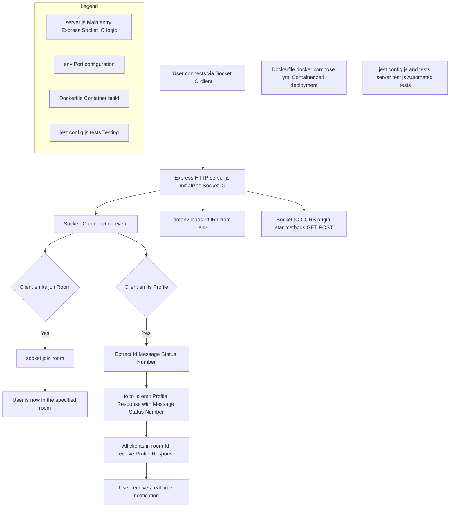

# Messages_User Microservice

## Description
The Messages_User microservice is a real-time messaging system based on Socket.IO, enabling bidirectional communication between users. It is specifically designed to handle profile updates and real-time notifications.

## Flowchart of the Real-Time Notification System (Socket.IO)

This flowchart outlines the real-time communication logic using Socket.IO. When a user connects through a Socket.IO client, the Express server handles the initialization and connection events.

The server listens for specific client events like `joinRoom` to subscribe the user to a room (identified by an ID), and `Profile`, which triggers a notification broadcast to the corresponding room with the status and message payload.

This architecture supports scalable communication by using rooms and provides CORS configuration, environment setup via dotenv, containerized deployment with Docker, and automated testing with Jest.



## Features
- Real-time communication using Socket.IO
- Room-based system for targeted messaging
- User profile event handling
- CORS support
- Environment variable configuration

## Technologies Used
- Node.js
- Express.js
- Socket.IO
- dotenv

## Main Dependencies
```json
{
  "express": "^4.x.x",
  "socket.io": "^4.x.x",
  "dotenv": "^16.x.x"
}
```

## Configuration
1. Create a `.env` file in the project root:
```plaintext
PORT=3000
```

## Socket.IO Events

### joinRoom
- **Purpose**: Allows a user to join a specific room
- **Parameters**: `room` (string) - Room identifier

### Profile
- **Purpose**: Handles profile updates and sends notifications
- **Parameters**:
  - `Id` (string): User/room identifier
  - `Message` (string): Message to send
  - `Status` (boolean): Update status

## Installation and Execution

### Local
1. Install dependencies:
   ```bash
   npm install
   ```

2. Start the server:
   ```bash
   npm start
   ```

### Docker
The service includes Docker configuration for containerized deployment.

1. Build the image:
   ```bash
   docker build -t messages-user .
   ```

2. Run the container:
   ```bash
   docker run -p 3000:3000 messages-user
   ```

## CORS Usage
The service is configured to accept requests with the following parameters:
- Methods: GET, POST
- Allowed Headers: Content-Type

## Project Structure
```
Messages_User/
├── .env
├── server.js        # Main entry point
├── Dockerfile       # Docker configuration
├── package.json     # Dependencies and scripts
└── docker-compose.yml
```

## Contribution
1. Fork the repository
2. Create a feature branch (`git checkout -b feature/AmazingFeature`)
3. Commit your changes (`git commit -m 'Add some AmazingFeature'`)
4. Push to the branch (`git push origin feature/AmazingFeature`)
5. Open a Pull Request

## Security
- The service implements CORS for access control
- SSL/TLS configuration is recommended for production
- Sensitive variables should be managed through environment variables

## Development Notes
- The server is optimized for real-time communication
- Uses the event pattern for message handling
- The architecture supports horizontal scaling with multiple instances
```
