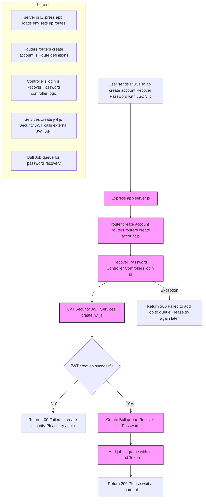

# Orchestrator Service

This service acts as an API gateway and orchestrator for user account operations, such as password recovery, in the Proyecto Octavo platform. It is built with Node.js and Express, uses Bull for job queueing, and is containerized with Docker for easy deployment.

## Flowchart of the Password Recovery Flow

This flowchart illustrates the process triggered when a user submits a POST request to recover their password. The server uses a layered architecture consisting of routers, controllers, and services. Upon a valid request, the controller generates a security token (JWT) and enqueues a job via Bull for further processing.

If the token creation fails or an exception occurs, the system returns an appropriate error response. The system is built to be modular and scalable using Bull queue processing and JWT-based validation.



---

## Table of Contents

- [Project Structure](#project-structure)
- [Features](#features)
- [Installation](#installation)
- [Usage](#usage)
- [API Endpoints](#api-endpoints)
- [Environment Variables](#environment-variables)
- [Docker Usage](#docker-usage)
- [Development Notes](#development-notes)

---

## Project Structure

```
Back/Orchestrator/
│
├── .dockerignore
├── .env
├── .gitignore
├── docker-compose.yml
├── Dockerfile
├── package.json
├── server.js
│
├── Controllers/
│   └── login.js
├── Routers/
│   └── routers_create_account.js
├── Services/
│   └── create_jwt.js
```

---

## Features

- **REST API** for user account orchestration (e.g., password recovery).
- Uses **Bull** for job queueing and Redis for background processing.
- JWT security integration via external API.
- Modular codebase following best practices.
- CORS enabled for cross-origin requests.
- Dockerized for easy deployment.

---

## Installation

### Prerequisites

- Node.js 18+
- [npm](https://www.npmjs.com/)
- (Optional) [Docker](https://www.docker.com/)
- Access to a Redis instance for Bull queues

### Steps

1. **Clone the repository:**
   ```sh
   git clone <repository-url>
   cd Back/Orchestrator
   ```

2. **Install dependencies:**
   ```sh
   npm install
   ```

3. **Configure environment variables:**  
   Edit the `.env` file with your settings (see [Environment Variables](#environment-variables)).

---

## Usage

### Run Locally

```sh
npm start
```

The API will be available at [http://localhost:4027](http://localhost:4027) (or the port you set in `.env`).

---

## API Endpoints

### `POST /api/create_account/Recover_Password`

**Description:**  
Initiates the password recovery process for a user. Adds a job to the Bull queue after validating the request and generating a JWT.

**Request Body (JSON):**
```json
{
  "Id": "user_id"
}
```

**Response (Success):**
```json
{
  "Response": "Please wait a moment",
  "Status": true
}
```

**Response (Error):**
```json
{
  "Response": "Failed to create security. Please try again.",
  "Status": false
}
```

---

## Environment Variables

The `.env` file should contain:

```
PORT=4027

# Redis configuration for Bull queues
BULL_USERS_HOST=52.201.55.56
BULL_USERS_PORT=6379

# JWT API endpoint
API_JWT=http://35.171.131.67:4012
```

---

## Docker Usage

### Build and Run with Docker Compose

```sh
docker-compose up --build
```

- The service will be available at port `4027` (mapped from internal port).

### Dockerfile Highlights

- Uses `node:22-bullseye` as the base image.
- Installs all dependencies.
- Exposes port `4027`.

---

## Development Notes

- **Job Queueing:**  
  Uses Bull to manage background jobs for password recovery, communicating with Redis.
- **JWT Security:**  
  Requests JWT tokens from an external API before adding jobs to the queue.
- **Error Handling:**  
  Returns clear error messages for failed operations.
- **Extensibility:**  
  The modular structure allows for easy addition of new account-related endpoints and services.

