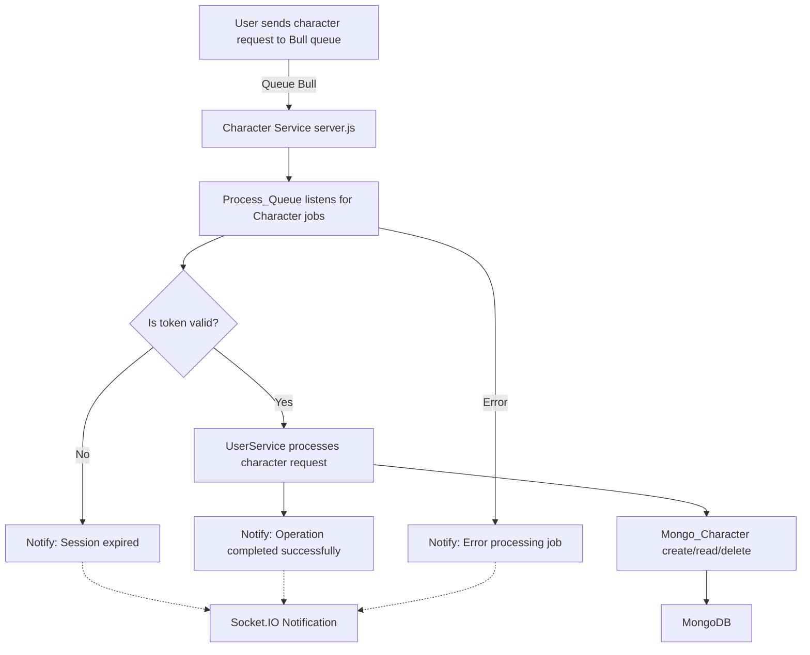
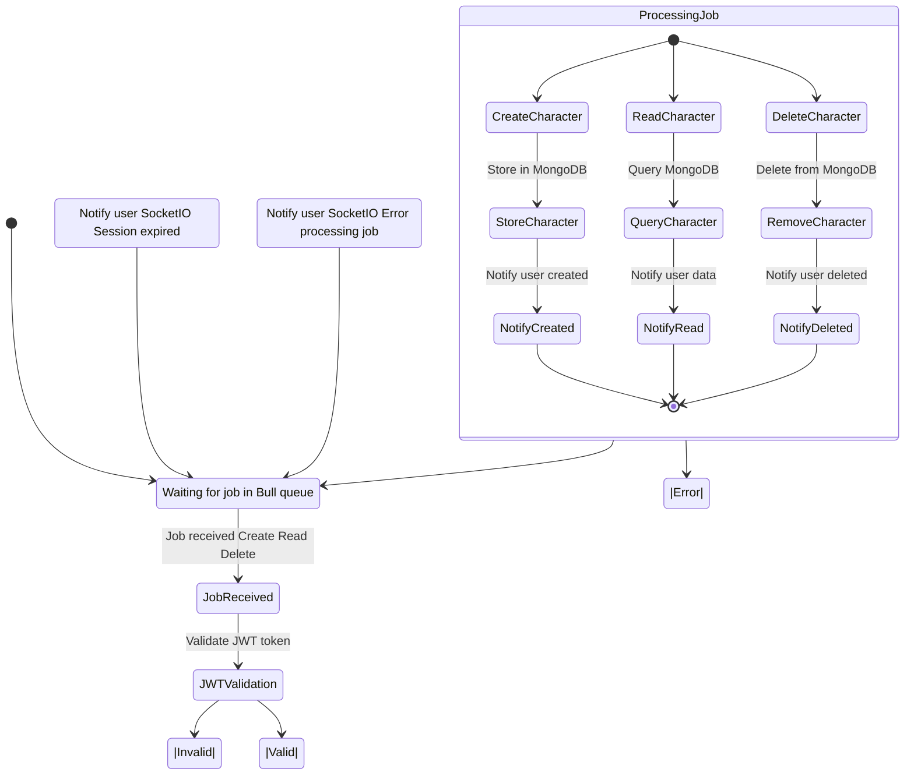
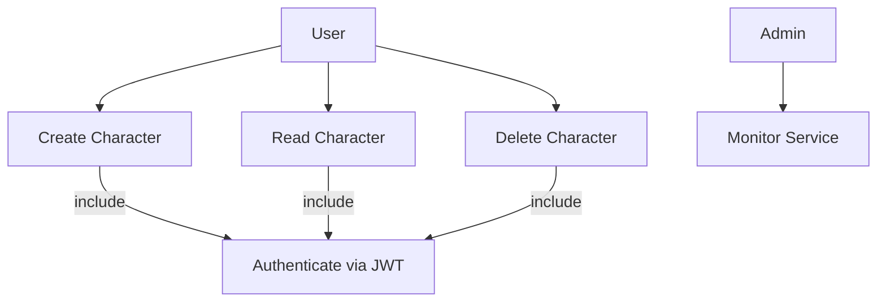

# Character Microservices

This module is part of the Proyecto Octavo platform and provides microservices for character management: creation, reading, and deletion. Each service is containerized, uses Bull queues for asynchronous processing, JWT for authentication, MongoDB for persistence, and Socket.IO for real-time notifications.

---

## Process Flow (Mermaid)



---

## State Diagram



---

## Use Case Diagram



---

## Main Classes & Components

- **server.js**: Entry point, sets up Express, Bull queue, and Socket.IO.
- **Services/**
  - `jwt.service.js`: JWT validation.
  - `user.service.js`: Character CRUD logic.
  - `notification.service.js`: Real-time notifications.
- **Config/**
  - `mongo.config.js`: MongoDB connection/model.
  - `redis.config.js`: Redis/Bull queue config.
- **Database**
  - MongoDB: Stores character documents.

---

## Example Request Flow

1. **User** submits a character creation request (with JWT) to the Bull queue.
2. **server.js** picks up the job, validates the JWT.
3. If valid, **user.service.js** processes the request (create/read/delete).
4. The result is stored or retrieved from **MongoDB**.
5. **notification.service.js** sends a real-time notification to the user via **Socket.IO**.
6. If any error occurs, the user is notified accordingly.

---

## Features

- Asynchronous, queue-based processing (Bull + Redis)
- JWT authentication for all operations
- MongoDB for persistent storage
- Real-time notifications via Socket.IO
- Modular, containerized microservices

---

## Example Environment Variables

```env
PORT=4016
PORT_MESSAGES_USERS=4003
MONGODB_URI=mongodb://localhost:27017/storybang
REDIS_HOST=localhost
REDIS_PORT=6379
JWT_SECRET=your_secret_key
```

---

## Summary

The Character Creator microservices provide a robust, scalable, and secure way to manage character data in the Proyecto Octavo platform, leveraging modern Node.js patterns and cloud-native best practices.