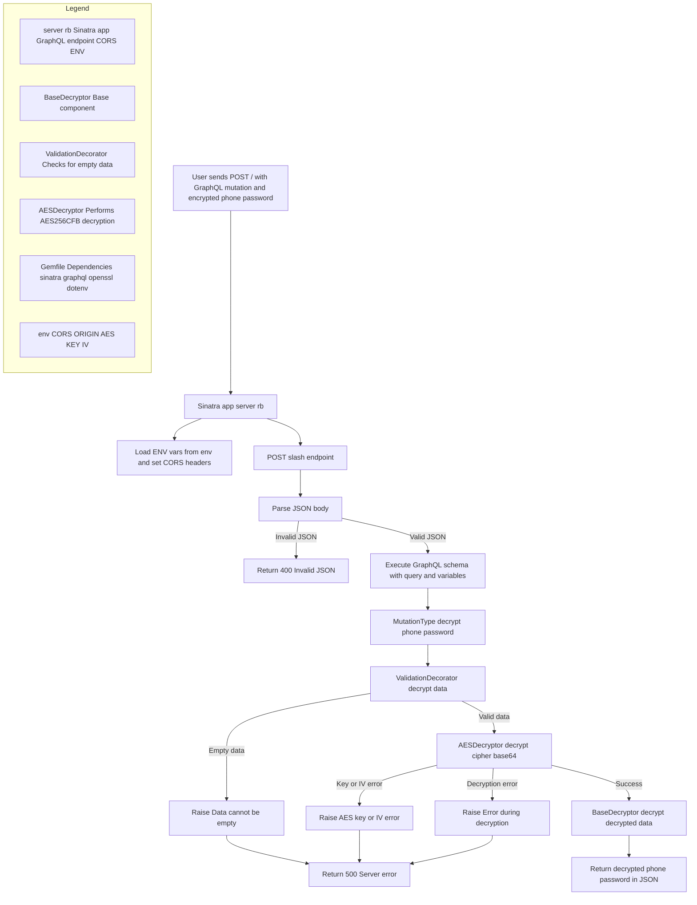

# Decrypt Microservice

## Description
A decryption microservice implemented in Ruby that provides a GraphQL endpoint for decrypting sensitive data (phone and password) using the AES-256-CFB algorithm. It employs the Decorator pattern to handle decryption and validation logic.

## GraphQL Login Mutation - Decryption Flow (Sinatra)

This flowchart illustrates how a Sinatra-based backend handles a POST request to decrypt an encrypted phone and password using a GraphQL mutation and a decorator-based decryption chain.



## Features
- GraphQL API for decryption
- AES-256-CFB decryption
- Decorator design pattern
- Robust error handling
- CORS support
- Input data validation

## Technologies
- Ruby
- Sinatra
- GraphQL
- OpenSSL

## Dependencies
```ruby
require 'sinatra'
require 'json'
require 'base64'
require 'openssl'
require 'graphql'
```

## Configuration
Required environment variables:
- `AES_KEY`: 32-byte AES key (default value available for development)
- `AES_IV`: 16-byte initialization vector (default value available for development)

## GraphQL API

### Endpoint
- URL: `/`
- Method: `POST`

### Mutation
```graphql
mutation {
  decrypt(
    phone: "base64_encrypted_phone",
    password: "base64_encrypted_password"
  ) {
    phone
    password
  }
}
```

### Response Format
```json
{
  "data": {
    "decrypt": {
      "phone": "decrypted_phone",
      "password": "decrypted_password"
    }
  }
}
```

## Error Handling
- Key and IV length validation
- Decryption error handling
- Empty data validation
- JSON parsing errors
- Server errors

## CORS Configuration
- Origin: `*`
- Allowed methods: `POST, OPTIONS`
- Allowed headers: `Content-Type`

## Architecture
Implements the Decorator pattern with three main components:
1. `BaseDecryptor`: Base component
2. `AESDecryptor`: Decorator for AES decryption
3. `ValidationDecorator`: Decorator for data validation

## Execution

### Local
```bash
bundle install
ruby server.rb
```

### Docker
```bash
docker build -t decrypt-service .
docker-compose up
```

## Security Considerations
- Uses AES-256-CFB for secure decryption
- Input data validation
- Secure error handling without exposing sensitive details
- Recommended to configure environment variables in production

## Contribution
1. Fork the repository
2. Create a feature branch (`git checkout -b feature/new-feature`)
3. Commit changes (`git commit -am 'Add new feature'`)
4. Push to the branch (`git push origin feature/new-feature`)
5. Create a Pull Request

## Development Notes
- Ensure proper configuration of environment variables
- Test the GraphQL endpoint before deployment
- Verify compatibility with the encryption service
- Maintain the security of encryption keys