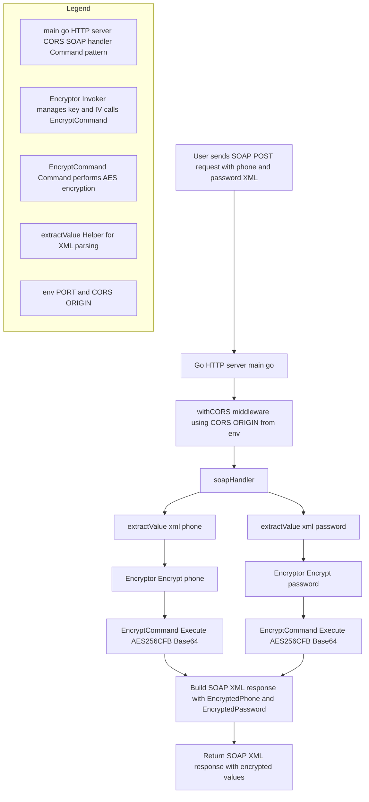

# Encrypt Microservice

A SOAP-based microservice for encrypting sensitive data using AES-256-CFB encryption algorithm, implemented in Go using the Command pattern.

## SOAP Encryption Flow - Go HTTP Server



## Features

- AES-256-CFB encryption with configurable key and IV
- SOAP API endpoint for encryption operations
- XML request/response handling
- Command pattern implementation for encryption operations
- Base64 encoding of encrypted data

## Technologies

- Go
- Standard library packages:
  - `crypto/aes`
  - `crypto/cipher`
  - `encoding/base64`
  - `net/http`

## Architecture

The service implements the Command pattern with the following components:

1. `Command` interface:
   - Defines the contract for encryption operations

2. `EncryptCommand` struct:
   - Concrete implementation of the Command interface
   - Handles AES encryption logic

3. `Encryptor` struct:
   - Acts as the invoker in the Command pattern
   - Manages encryption keys and initialization vectors

## Configuration

The service uses hardcoded values for encryption (should be configured via environment variables in production):

- AES Key: 32 bytes
- Initialization Vector (IV): 16 bytes

## API

### SOAP Endpoint

- **URL**: `http://localhost:4005/`
- **Method**: `POST`
- **Content-Type**: `text/xml`

### Request Format

```xml
<soap:Envelope xmlns:soap="http://schemas.xmlsoap.org/soap/envelope/">
  <soap:Body>
    <phone>phone_value</phone>
    <password>password_value</password>
  </soap:Body>
</soap:Envelope>
```

### Response Format

```xml
<?xml version="1.0" encoding="UTF-8"?>
<soap:Envelope xmlns:soap="http://schemas.xmlsoap.org/soap/envelope/">
  <soap:Body>
    <EncryptResponse xmlns="http://encrypt.com/">
      <EncryptedPhone>encrypted_base64_string</EncryptedPhone>
      <EncryptedPassword>encrypted_base64_string</EncryptedPassword>
    </EncryptResponse>
  </soap:Body>
</soap:Envelope>
```

## Encryption Process

1. Extracts phone and password values from SOAP request
2. Encrypts each value using AES-256-CFB
3. Encodes encrypted data in Base64
4. Returns encrypted values in SOAP response

## Running the Service

1. Build the service:
   ```bash
   go build main.go
   ```

2. Run the service:
   ```bash
   ./main
   ```

The service will be available at `http://localhost:4005`

## Docker Support

The service includes:
- `Dockerfile`
- `docker-compose.yml`

## Security Considerations

1. Move encryption key and IV to environment variables
2. Implement proper error handling
3. Add input validation
4. Use HTTPS in production
5. Add request rate limiting
6. Implement logging for security events

## Contributing

1. Fork the repository
2. Create your feature branch
3. Commit your changes
4. Push to the branch
5. Create a new Pull Request

## Development Notes

- The service uses Go's standard library for cryptographic operations
- Implements the Command pattern for extensibility
- Uses string manipulation for XML parsing (consider using proper XML parser in production)
- Currently runs on HTTP (use HTTPS for production)
```