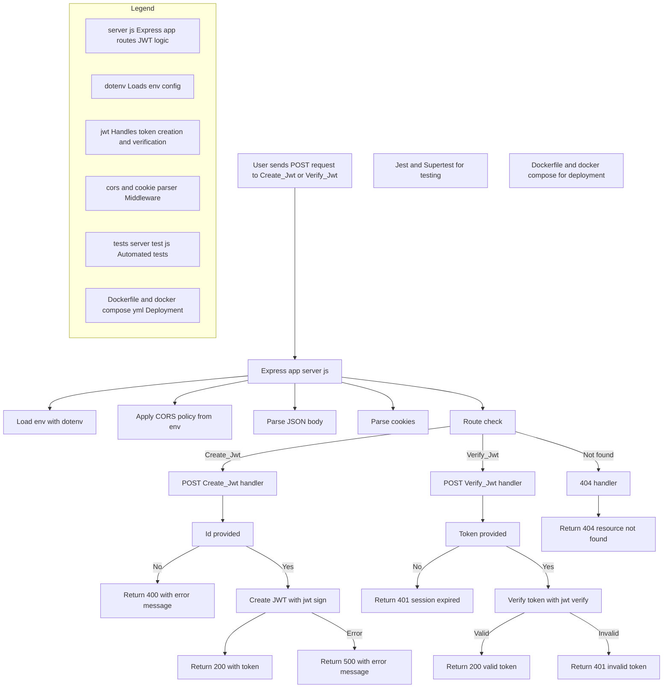

# JWT Microservice

A microservice for handling JSON Web Token (JWT) operations, including token creation and verification.

## JWT Creation and Verification Flow - Express.js




## Features

- JWT token creation with expiration
- Token verification
- CORS support
- Error handling
- Cookie parsing

## Technologies

- Node.js
- Express.js
- JSON Web Tokens (jsonwebtoken)
- CORS
- Cookie Parser

## Dependencies

```json
{
  "express": "Web framework",
  "cors": "Cross-Origin Resource Sharing",
  "dotenv": "Environment configuration",
  "jsonwebtoken": "JWT implementation",
  "cookie-parser": "Cookie handling"
}
```

## Configuration

The service uses environment variables for configuration:

```env
PORT=3000                    # Default port if not specified
JWT_SECRET_KEY=your_secret   # Secret key for JWT signing
CORS_ORIGIN=allowed_origin   # Allowed CORS origin
NODE_ENV=development         # Environment mode
```

## API Endpoints

### Create JWT Token

- **URL**: `/Create_Jwt`
- **Method**: `POST`
- **Body**:
  ```json
  {
    "Id": "user_id"
  }
  ```
- **Success Response**:
  ```json
  {
    "Status": true,
    "Response": "Security created successfully",
    "Content": "jwt_token"
  }
  ```
- **Error Response**:
  ```json
  {
    "Status": false,
    "Response": "ID es requerido"
  }
  ```

### Verify JWT Token

- **URL**: `/Verify_Jwt`
- **Method**: `POST`
- **Body**:
  ```json
  {
    "Token": "jwt_token"
  }
  ```
- **Success Response**:
  ```json
  {
    "Status": true,
    "Response": "Valid token",
    "Id": "decoded_token_data"
  }
  ```
- **Error Response**:
  ```json
  {
    "Status": false,
    "Response": "Invalid token or session expired. Please log in again."
  }
  ```

## Security Features

1. Token Expiration: 1 hour
2. CORS Protection
3. Cookie Security
4. Error Handling

## Running the Service

1. Install dependencies:
   ```bash
   npm install
   ```

2. Set up environment variables in `.env`

3. Start the service:
   ```bash
   npm start
   ```

The service will be available at `http://localhost:{PORT}`

## Docker Support

The service includes:
- `Dockerfile`
- `docker-compose.yml`
- `.dockerignore`

## Testing

The service includes Jest configuration for testing:
- `jest.config.js`
- `babel.config.json`

Run tests with:
```bash
npm test
```

## Error Handling

The service handles various scenarios:

- Missing ID for token creation
- Invalid tokens
- Expired tokens
- Missing tokens
- Not found routes

## Security Considerations

1. Use strong JWT_SECRET_KEY in production
2. Configure CORS appropriately
3. Implement rate limiting
4. Use HTTPS in production
5. Regular security audits

## Contributing

1. Fork the repository
2. Create your feature branch
3. Commit your changes
4. Push to the branch
5. Create a new Pull Request
```