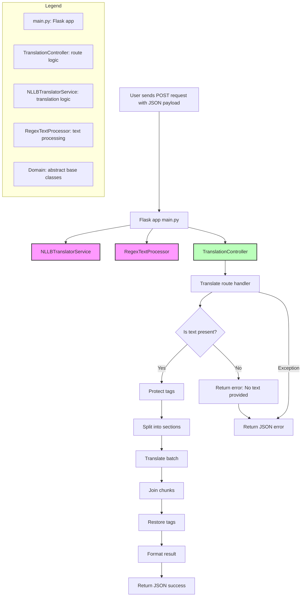

# Translator Service

This microservice provides a RESTful API for translating text using Meta's NLLB-200 model. It is built with Python, Flask, and Hugging Face Transformers, and is containerized with Docker for easy deployment. The service includes advanced text processing to protect and restore tags, split large texts, and format results.

---

## Flowchart of the Translation Module

This flowchart represents the main architecture of the translation service module. It handles incoming translation requests, processes text with specialized services, manages error handling, and returns the translation result. The architecture uses a Flask app for routing, a translation service for handling translations, a text processor for managing special tags, and consistent JSON responses for success or error states.




## Table of Contents

- [Project Structure](#project-structure)
- [Features](#features)
- [Installation](#installation)
- [Usage](#usage)
- [API Endpoint](#api-endpoint)
- [Environment Variables](#environment-variables)
- [Docker Usage](#docker-usage)
- [Development Notes](#development-notes)
- [License](#license)

---

## Project Structure

```
Back/Translator/
│
├── .dockerignore
├── .gitignore
├── docker-compose.yml
├── Dockerfile
├── main.py
├── requirements.txt
│
└── src/
    ├── api/
    │   └── translation_controller.py
    ├── domain/
    │   ├── text_processor.py
    │   └── translator_service.py
    └── infrastructure/
        ├── nllb_translator_service.py
        └── regex_text_processor.py
```

---

## Features

- **REST API** for text translation using the NLLB-200 model.
- **Advanced Text Processing:** Protects and restores tags, splits large texts into sections, and formats output.
- **Batch Translation:** Efficiently translates large texts by splitting and batching.
- **Extensible Architecture:** Follows SOLID principles with clear separation between API, domain, and infrastructure.
- **Dockerized:** Ready for deployment in containerized environments.
- **CORS Enabled:** Allows cross-origin requests.

---

## Installation

### Prerequisites

- Python 3.10+
- [pip](https://pip.pypa.io/en/stable/)
- (Optional) [Docker](https://www.docker.com/)

### Steps

1. **Clone the repository:**
   ```sh
   git clone <repository-url>
   cd Back/Translator
   ```

2. **Install dependencies:**
   ```sh
   pip install -r requirements.txt
   ```

---

## Usage

### Run Locally

```sh
python main.py
```

The API will be available at [http://localhost:4020](http://localhost:4020).

---

## API Endpoint

### `POST /translate`

**Description:**  
Translates the provided text into the target language.

**Request Body (JSON):**
```json
{
  "Text": "Your text to translate [Tag1] ...",
  "Tgt_lang": "target_language_token"
}
```
- `Text`: The text to be translated. Tags in square brackets (e.g., `[Tag1]`) are protected during translation.
- `Tgt_lang`: The target language token as required by the NLLB-200 model (e.g., `eng_Latn`, `spa_Latn`).

**Response (Success):**
```json
{
  "Content": "Translated text with tags restored and formatted.",
  "Status": true
}
```

**Response (Error):**
```json
{
  "error": "Error message",
  "Status": false
}
```

---

## Environment Variables

No environment variables are required by default. You can customize the port in `main.py` if needed.

---

## Docker Usage

### Build and Run with Docker Compose

```sh
docker-compose up --build
```

- The service will be available at port `4020` (as mapped in `docker-compose.yml`).

### Dockerfile Highlights

- Uses `python:3.10-slim` as the base image.
- Installs PyTorch and Hugging Face Transformers.
- Exposes port `4020`.

---

## Development Notes

- **Text Processing:**  
  The `RegexTextProcessor` protects tags (e.g., `[Content]`, `[Option 1]`), splits text into manageable sections, and formats the final output.
- **Translation:**  
  The `NLLBTranslatorService` loads the NLLB-200 model and performs translation, supporting both single and batch translation.
- **Extensibility:**  
  You can add new translation models or text processors by implementing the abstract base classes in `src/domain/`.

---

## License

MIT

---

## Author

Proyecto Octavo Team