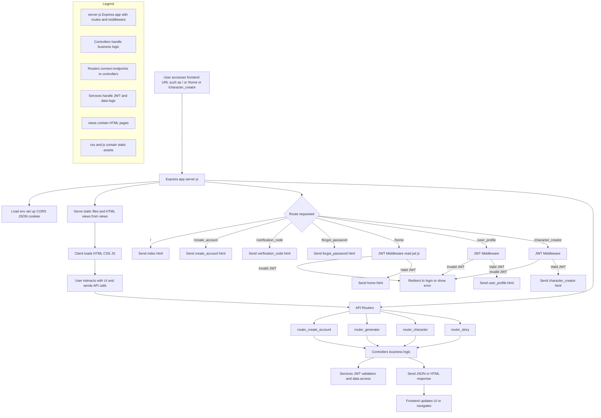

# Frontend

This is the frontend for Proyecto Octavo, a web application that allows users to create, manage, and view AI-generated stories. The frontend is built with Node.js, Express, and standard web technologies (HTML, CSS, JavaScript).

---

## Flowchart of the Frontend Routing and Access Control

This flowchart illustrates the routing logic of the Express backend that serves both HTML pages and API endpoints. It shows how user requests are handled when accessing URLs such as `/`, `/home`, or `/character_creator`, and how JWT validation is performed before serving protected routes.



## Project Structure

```
Frontend/
│
├── .dockerignore
├── .env
├── .gitignore
├── docker-compose.yml
├── Dockerfile
├── package.json
├── server.js
│
├── Controllers/
│   ├── character.js
│   ├── generator.js
│   ├── login.js
│   └── story.js
│
├── css/
│   ├── 404.css
│   ├── character_creator.css
│   ├── forgot_password.css
│   ├── home.css
│   ├── index.css
│   ├── list.css
│   ├── story_creator.css
│   ├── story.css
│   ├── user_profile.css
│   └── wait.css
│
├── js/
│   ├── character_creator.js
│   ├── create_account.js
│   ├── forgot_password.js
│   ├── home.js
│   ├── index.js
│   ├── list.js
│   ├── messages_user.js
│   ├── story_creator.js
│   ├── story.js
│   ├── user_profile.js
│   └── wait.js
│
├── Routers/
│   └── ... (Express route definitions)
│
├── Services/
│   └── ... (Auxiliary services and business logic)
│
├── src/
│
└── views/
    └── ... (HTML views for frontend rendering)
```

---

## Folder and File Descriptions

- **server.js:**  
  Main entry point. Initializes the Express server, configures middleware, routes, and serves static files and HTML views.

- **package.json:**  
  Lists project dependencies and scripts.

- **Controllers/**  
  Express controllers handling business logic for characters, stories, authentication, and content generation.

- **Routers/**  
  Express route definitions, connecting HTTP endpoints to controllers.

- **Services/**  
  Auxiliary services encapsulating reusable logic, such as JWT authentication and data access.

- **css/**  
  CSS stylesheets for different pages and components.

- **js/**  
  Client-side JavaScript for dynamic page interactions.

- **views/**  
  HTML files rendered for each route (e.g., `index.html`, `home.html`, `user_profile.html`, etc.).

- **src/**  
  Reserved for additional source code or utilities.

- **.env:**  
  Environment variables for sensitive configuration (ports, secrets, etc.).

- **Dockerfile & docker-compose.yml:**  
  Files for containerizing and deploying the frontend using Docker.

---

## Main Features

- User registration and authentication
- Character creation and editing
- AI-powered story generation
- Story listing and viewing
- User profile and account management
- Responsive and user-friendly interface

---

## Installation and Running

1. **Clone the repository:**
   ```
   git clone <repository-url>
   cd Frontend
   ```

2. **Install dependencies:**
   ```
   npm install
   ```

3. **Configure environment variables:**  
   Create a `.env` file based on the provided example and set the required values.

4. **Start the development server:**
   ```
   npm start
   ```
   The frontend will be available at [http://localhost:3000](http://localhost:3000) (or the port you set).

5. **(Optional) Run with Docker:**
   ```
   docker-compose up --build
   ```
   This will build and run the frontend in a Docker container, mapping to port 80 by default.

---

## Example Routes

The server serves static HTML files for each route. Some examples from `server.js`:

- `/` → `views/index.html`
- `/create_account` → `views/create_account.html`
- `/verification_code` → `views/verification_code.html`
- `/forgot_password` → `views/forgot_password.html`
- `/home` (JWT protected) → `views/home.html`
- `/user_profile` (JWT protected) → `views/user_profile.html`
- `/character_creator` (JWT protected) → `views/character_creator.html`

---

## Contribution

1. Fork the repository.
2. Create a new branch: `git checkout -b my-feature`
3. Make your changes and commit: `git commit -am 'Add new feature'`
4. Push to your branch: `git push origin my-feature`
5. Open a Pull Request.

