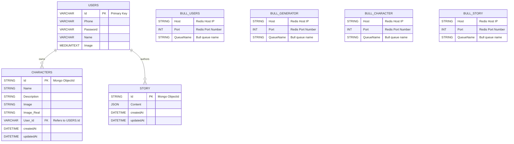
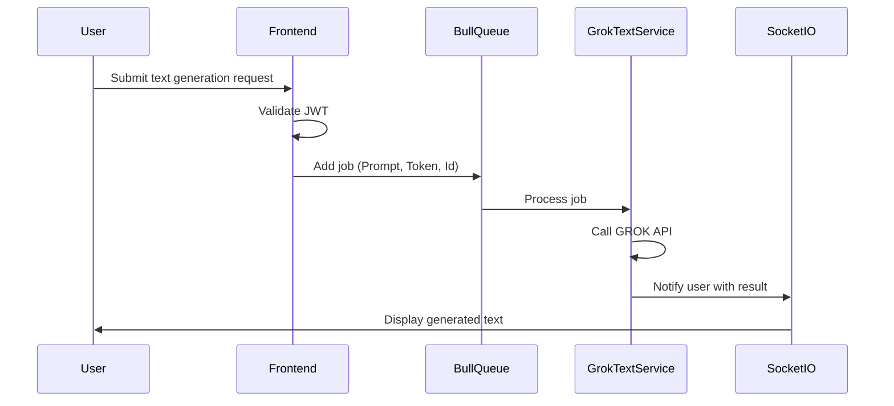

# Generator Subsystem Overview

This subsystem is responsible for AI-powered content generation in the Proyecto Octavo platform. It includes microservices for generating stories (using GPT-2), generating and describing images, and translating text. The architecture is modular, scalable, and uses both REST and queue-based asynchronous processing.

---

## Architecture

- **Frontend**:  
  - Built with Node.js and Express.
  - Exposes REST API endpoints (e.g., `/api/router_generator/Grok_Text_Generator`) that receive user requests.
  - Forwards requests to backend generator microservices via Bull queues or direct HTTP calls.
  - Handles authentication via JWT and manages user sessions.
  - Provides static assets and HTML views for user interaction.

- **Backend (Generator Microservices)**:  
  - Each generator (text, image, description, translation) is a separate microservice.
  - Some services (GROK-based) use Bull queues and Redis for asynchronous job processing.
  - GPT-2 services expose REST APIs (Flask/Python).
  - All services are containerized with Docker and orchestrated via Docker Compose.

---

## 🧱 Database Architecture and Redis Bull Queues Configuration



## Main Generator Services

### 1. Gpt2_Text_Generator

- **Purpose**: Generates stories using a custom-trained GPT-2 model.
- **Tech**: Python, Flask, Hugging Face Transformers.
- **API**: Receives prompt and audience type, returns generated story.
- **Frontend Flow**:  
  - User submits a story prompt.
  - Frontend controller (`Controllers/generator.js`) calls the GPT-2 API.
  - Response is returned to the user.

### 2. Gpt2Medium_Text_Generator

- **Purpose**: Similar to above, but for "medium" stories or a different model/config.
- **Tech**: Python, Flask.
- **API**: Same as above.

### 3. Grok_Text_Generator

- **Purpose**: Generates text using GROK (x.ai) via asynchronous queue.
- **Tech**: Node.js, Bull, Redis, Express.
- **Flow**:
  - Frontend receives user request, authenticates, and adds a job to the "Grok_Text_Generator" queue.
  - Backend worker processes the job, calls GROK API, and notifies the user via Socket.IO.

### 4. Grok_Image_Generator

- **Purpose**: Generates images from prompts using GROK (x.ai).
- **Tech**: Node.js, Bull, Redis.
- **Flow**:
  - Similar to text generator, but returns an image (base64 or URL).

### 5. Grok_Description_Image

- **Purpose**: Generates detailed image descriptions using GROK vision models.
- **Tech**: Node.js, Bull, Redis.
- **Flow**:
  - User submits an image prompt.
  - Job is queued and processed asynchronously.
  - Description is returned via notification.

### 6. Translator

- **Purpose**: Translates text using Meta's NLLB-200 model.
- **Tech**: Python, Flask, Hugging Face Transformers.
- **API**: Receives text and target language, returns translation.

---

## Frontend Integration

- **Routers**:  
  - `Routers/routers_generator.js` defines endpoints for each generator service.
  - Each endpoint calls the corresponding controller in `Controllers/generator.js`.

- **Controllers**:  
  - Validate user session (JWT).
  - Add jobs to Bull queues or call REST APIs.
  - Return immediate response ("Please wait a moment") while job is processed.

- **Socket.IO**:  
  - Used for real-time notifications when asynchronous jobs complete.

- **Static Assets**:  
  - HTML, CSS, and JS files provide the user interface for submitting prompts and viewing results.

---

## Example Flow (Grok_Text_Generator)



---

## Project Structure

```
Back/Generator/
│
├── Gpt2_Text_Generator/
│   ├── main.py
│   ├── src/
│   │   ├── api/
│   │   ├── domain/
│   │   └── infrastructure/
│   └── story_model/
├── Gpt2Medium_Text_Generator/
├── Grok_Text_Generator/
├── Grok_Image_Generator/
├── Grok_Description_Image/
├── Translator/
└── README.md
```

---

## Key Technologies

- **Python (Flask, Transformers)**: For GPT-2 and translation services.
- **Node.js (Express, Bull, Redis)**: For GROK-based generators and queue management.
- **Docker**: All services are containerized.
- **Socket.IO**: Real-time notifications to frontend.
- **JWT**: Authentication for secure requests.

---

## How to Use

1. **Frontend**:  
   - Users interact with the UI to submit prompts for stories, images, or translations.
   - Requests are routed to the appropriate backend service.

2. **Backend**:  
   - Jobs are processed asynchronously (for GROK) or synchronously (for GPT-2/Translator).
   - Results are sent back to the user via HTTP response or Socket.IO notification.

3. **Deployment**:  
   - Use Docker Compose to orchestrate all services.
   - Environment variables configure Redis, API endpoints, and authentication.

---

## Development Notes

- Each generator service is independent and can be scaled or updated separately.
- The system supports both synchronous (REST) and asynchronous (queue-based) processing.
- Modular codebase allows easy addition of new generator types or models.

---

## Authors

Proyecto Octavo Team