# Generator Subsystem Overview

This subsystem is responsible for AI-powered content generation in the Proyecto Octavo platform. It includes microservices for generating stories (using GPT-2), generating and describing images, and translating text. The architecture is modular, scalable, and uses both REST and queue-based asynchronous processing.

---

## Architecture

- **Frontend**:  
  - Built with Node.js and Express.
  - Exposes REST API endpoints (e.g., `/api/router_generator/Grok_Text_Generator`) that receive user requests.
  - Forwards requests to backend generator microservices via Bull queues or direct HTTP calls.
  - Handles authentication via JWT and manages user sessions.
  - Provides static assets and HTML views for user interaction.

- **Backend (Generator Microservices)**:  
  - Each generator (text, image, description, translation) is a separate microservice.
  - Some services (GROK-based) use Bull queues and Redis for asynchronous job processing.
  - GPT-2 services expose REST APIs (Flask/Python).
  - All services are containerized with Docker and orchestrated via Docker Compose.

---

## 🧱 High-Level Architecture Infrastructure
```mermaid
graph TD
    A[External User] -->|Access| B[Frontend]
    B -->|Authentication| C[User]
    B -->|Notifications| D[Message]
    B -->|Query/Display| E[Character]
    B -->|Query/Display| F[Story]
    B -->|Generation| G[Generate]
    B -->|Permissions| H[Security]
    B -->|Orchestrator| I[Orchestrator]
```

## 🧱 Low-Level Architecture Infrastructure
[View PDF document](./low_architecture.pdf)


## 🧱 High-Level Architecture Software 


## 🧱 Low-Level Architecture Software (Frontend to Backend Flow)


## 🧱 Low-Level System Architecture and Connection Flow


## 🧱 Database Architecture and Redis Bull Queues Configuration


## 🧱 Use Case Diagram

## Business process flowchart 


Claro, aquí tienes todo el contenido traducido al español:

---

## 🧱 Arquitectura de Infraestructura de Alto Nivel

```mermaid
graph TD
    A[Usuario Externo] -->|Accede| B[Frontend]
    B -->|Autenticación| C[Usuario]
    B -->|Notificaciones| D[Mensaje]
    B -->|Consulta/Visualización| E[Personaje]
    B -->|Consulta/Visualización| F[Historia]
    B -->|Generación| G[Generar]
    B -->|Permisos| H[Seguridad]
    B -->|Orquestador| I[Orquestador]
```

## 🧱 Arquitectura de Infraestructura de Bajo Nivel

[Ver documento PDF](./low_architecture.pdf)

---

## 🧱 Arquitectura de Software de Alto Nivel

```mermaid
flowchart TD
    A[Frontend: Servidor Express JS] --> B[Rutas y Vistas]
    B --> C[Controladores y Servicios]
    C --> D[Capa de Microservicios]

    D --> E[Servicio de Login]
    D --> F[Servicio de Personaje]
    D --> G[Servicio de Historia]
    D --> H[Servicio de Generador]
    D --> I[Servicio de Seguridad]
    D --> J[Servicio de Notificaciones con Socket IO]

    H --> K[API Flask con GPT2]
    H --> L[Cola Redis Bull para GROK]
    L --> M[Trabajador procesa trabajo de GROK]
    M --> J

    I --> N[Servicio JWT]
    I --> O[Servicio de Encriptación]
    I --> P[Servicio de Desencriptación]

    D --> Q[Capa de Base de Datos: MySQL MongoDB Redis]
```



---

## 🧱 Arquitectura de Software de Bajo Nivel (Flujo Frontend a Backend)

```mermaid
flowchart TD
    A[Usuario accede al Frontend] --> B[Servidor Express JS - Frontend]

    B --> C{Ruta solicitada}
    C -- Ruta pública --> D[Servir HTML desde vistas]
    C -- Ruta protegida --> E[Middleware JWT - read_jwt.js]
    E -- JWT inválido --> F[Redireccionar a login o mostrar error]
    E -- JWT válido --> G[Servir HTML protegido desde vistas]

    D & G --> H[Usuario realiza llamada API vía AJAX o fetch]
    H --> I[Ruteo en Frontend]
    I --> J[Controladores del Frontend]
    J --> K[Servicios del Frontend]

    K --> L{Punto de entrada API}
    L -- Login --> M[Microservicios Crear_Usuario Eliminar_Usuario]
    L -- Historia --> N[Microservicios Crear_Historia Leer_Historia]
    L -- Personaje --> O[Microservicios Crear_Personaje, etc.]
    L -- Generador --> P[Microservicios Generador_Gpt2, Generador_Grok]
    L -- Seguridad --> Q[Microservicios Jwt, Encriptar, Desencriptar]
    L -- Mensajes --> R[Servidor Socket IO]

    M --> S[Microservicio JWT]
    S -- Válido --> T[Retornar JWT]
    S -- Inválido --> F

    P --> U{Tipo de Servicio}
    U -- GPT2 --> V[Llamada REST a servicio Flask]
    U -- GROK --> W[Añadir trabajo a cola Bull en Redis]
    W --> X[Trabajador procesa trabajo y llama API de GROK]
    X --> Y[Notificación vía Socket IO]

    T & Y & N & O --> Z[Frontend recibe respuesta o notificación]
    Z --> AA[Frontend actualiza la interfaz]

    R --> AB[Usuario se une a sala Socket IO]
    AB --> AC[Recibe notificaciones en tiempo real]
```



---

## 🧱 Arquitectura del Sistema de Bajo Nivel y Flujo de Conexión


---

## 🧱 Arquitectura de la Base de Datos y Configuración de Colas Redis Bull

```mermaid
erDiagram
    USERS {
        VARCHAR Id PK "Clave primaria"
        VARCHAR Phone
        VARCHAR Password
        VARCHAR Name
        MEDIUMTEXT Image
    }

    CHARACTERS {
        STRING Id PK "Mongo ObjectId"
        STRING Name
        STRING Description
        STRING Image
        STRING Image_Real
        VARCHAR User_Id FK "Referencia a USERS.Id"
        DATETIME createdAt
        DATETIME updatedAt
    }

    STORY {
        STRING Id PK "Mongo ObjectId"
        JSON Content
        DATETIME createdAt
        DATETIME updatedAt
    }

    BULL_USERS {
        STRING Host "IP del host Redis"
        INT Port "Puerto Redis"
        STRING QueueName "Nombre de la cola Bull"
    }

    BULL_GENERATOR {
        STRING Host "IP del host Redis"
        INT Port "Puerto Redis"
        STRING QueueName "Nombre de la cola Bull"
    }

    BULL_CHARACTER {
        STRING Host "IP del host Redis"
        INT Port "Puerto Redis"
        STRING QueueName "Nombre de la cola Bull"
    }

    BULL_STORY {
        STRING Host "IP del host Redis"
        INT Port "Puerto Redis"
        STRING QueueName "Nombre de la cola Bull"
    }
```



---

## 🧱 Diagrama de Casos de Uso

```mermaid
graph TB
    User((Usuario))
    Admin((Administrador))

    subgraph Acciones del Usuario
        UC1[Crear Personaje]
        UC2[Leer Personaje]
        UC3[Actualizar Personaje]
        UC4[Eliminar Personaje]
        UC5[Generar Historia]
        UC6[Generar Imagen]
        UC7[Describir Imagen]
        UC8[Traducir Texto]
        UC9[Iniciar Sesión]
        UC10[Registrarse]
        UC11[Recuperar Contraseña]
        UC12[Ver Perfil]
        UC13[Actualizar Perfil]
    end

    subgraph Acciones del Administrador
        AC1[Monitorear Servicio]
        AC2[Gestionar Usuarios]
        AC3[Ver Registros]
    end

    subgraph Requisito Común
        JWT[Autenticación vía JWT]
    end

    User --> UC1
    User --> UC2
    User --> UC3
    User --> UC4
    User --> UC5
    User --> UC6
    User --> UC7
    User --> UC8
    User --> UC9
    User --> UC10
    User --> UC11
    User --> UC12
    User --> UC13

    Admin --> AC1
    Admin --> AC2
    Admin --> AC3

    UC1 --> JWT
    UC2 --> JWT
    UC3 --> JWT
    UC4 --> JWT
    UC5 --> JWT
    UC6 --> JWT
    UC7 --> JWT
    UC8 --> JWT
    UC12 --> JWT
    UC13 --> JWT
```



---

## 🧱 Diagrama de Flujo del Proceso de Negocio

```mermaid
flowchart TD
    A[Usuario accede a la plataforma] --> B[Elige una opción]
    B --> C{¿Qué desea hacer?}

    C -->|Crear cuenta| D[Ingresa datos personales y confirma]
    D --> E[Recibe código de verificación]
    E --> F[Ingresa el código]
    F --> G{¿El código es correcto?}
    G -->|No| H[Se informa que el código es incorrecto]
    G -->|Sí| I[Cuenta creada y recibe confirmación]

    C -->|Iniciar sesión| J[Ingresa usuario y contraseña]
    J --> K{¿Las credenciales son correctas?}
    K -->|No| L[Se informa que las credenciales son incorrectas]
    K -->|Sí| M[Accede a su perfil y funciones]

    C -->|Recuperar contraseña| N[Ingresa nombre de usuario]
    N --> O[Recibe instrucciones de recuperación]
    O --> P[Recibe nueva contraseña por WhatsApp o correo]

    C -->|Crear personaje| Q[Completa formulario de personaje]
    Q --> R[Personaje se guarda en la cuenta]

    C -->|Ver personajes o historias| S[Muestra lista de personajes o historias]
    S --> T[Puede seleccionar y ver detalles]

    C -->|Generar historia o imagen| U[Elige tipo de generación y provee información]
    U --> V[Recibe historia o imagen generada]

    C -->|Eliminar cuenta, personaje o historia| W[Confirma eliminación]
    W --> X[Recibe confirmación de eliminación]

    H --> Y[Notificación mostrada en pantalla]
    L --> Y
    X --> Y

    I --> Z[Resultado o confirmación en pantalla]
    M --> Z
    P --> Z
    R --> Z
    T --> Z
    V --> Z
```




## Main Generator Services

### 1. Gpt2_Text_Generator

- **Purpose**: Generates stories using a custom-trained GPT-2 model.
- **Tech**: Python, Flask, Hugging Face Transformers.
- **API**: Receives prompt and audience type, returns generated story.
- **Frontend Flow**:  
  - User submits a story prompt.
  - Frontend controller (`Controllers/generator.js`) calls the GPT-2 API.
  - Response is returned to the user.

### 2. Gpt2Medium_Text_Generator

- **Purpose**: Similar to above, but for "medium" stories or a different model/config.
- **Tech**: Python, Flask.
- **API**: Same as above.

### 3. Grok_Text_Generator

- **Purpose**: Generates text using GROK (x.ai) via asynchronous queue.
- **Tech**: Node.js, Bull, Redis, Express.
- **Flow**:
  - Frontend receives user request, authenticates, and adds a job to the "Grok_Text_Generator" queue.
  - Backend worker processes the job, calls GROK API, and notifies the user via Socket.IO.

### 4. Grok_Image_Generator

- **Purpose**: Generates images from prompts using GROK (x.ai).
- **Tech**: Node.js, Bull, Redis.
- **Flow**:
  - Similar to text generator, but returns an image (base64 or URL).

### 5. Grok_Description_Image

- **Purpose**: Generates detailed image descriptions using GROK vision models.
- **Tech**: Node.js, Bull, Redis.
- **Flow**:
  - User submits an image prompt.
  - Job is queued and processed asynchronously.
  - Description is returned via notification.

### 6. Translator

- **Purpose**: Translates text using Meta's NLLB-200 model.
- **Tech**: Python, Flask, Hugging Face Transformers.
- **API**: Receives text and target language, returns translation.

---

## Frontend Integration

- **Routers**:  
  - `Routers/routers_generator.js` defines endpoints for each generator service.
  - Each endpoint calls the corresponding controller in `Controllers/generator.js`.

- **Controllers**:  
  - Validate user session (JWT).
  - Add jobs to Bull queues or call REST APIs.
  - Return immediate response ("Please wait a moment") while job is processed.

- **Socket.IO**:  
  - Used for real-time notifications when asynchronous jobs complete.

- **Static Assets**:  
  - HTML, CSS, and JS files provide the user interface for submitting prompts and viewing results.

---

## Example Flow (Grok_Text_Generator)


---

## Project Structure

The project is divided into two main parts:

### 🖥️ Frontend
The user interface that allows users to interact with the platform in an intuitive and user-friendly way.

### 🛠️ Backend
Handles the business logic, organized into specific modules or domains. Each domain is responsible for a specific functionality:

- **🔐 Security**: Manages authentication, authorization, and access control.
- **🤖 AI Generator**: Responsible for generating stories or images using artificial intelligence.
- **📚 Stories**: Manages the creation, editing, and storage of characters and stories.
- etc

```
Back/Generator/
│
├── Gpt2_Text_Generator/
│   ├── main.py
│   ├── src/
│   │   ├── api/
│   │   ├── domain/
│   │   └── infrastructure/
│   └── story_model/
├── Gpt2Medium_Text_Generator/
├── Grok_Text_Generator/
├── Grok_Image_Generator/
├── Grok_Description_Image/
├── Translator/
└── README.md
```

---

## Key Technologies

- **Python (Flask, Transformers)**: For GPT-2 and translation services.
- **Node.js (Express, Bull, Redis)**: For GROK-based generators and queue management.
- **Docker**: All services are containerized.
- **Socket.IO**: Real-time notifications to frontend.
- **JWT**: Authentication for secure requests.

---

## How to Use

1. **Frontend**:  
   - Users interact with the UI to submit prompts for stories, images, or translations.
   - Requests are routed to the appropriate backend service.

2. **Backend**:  
   - Jobs are processed asynchronously (for GROK) or synchronously (for GPT-2/Translator).
   - Results are sent back to the user via HTTP response or Socket.IO notification.

3. **Deployment**:  
   - Use Docker Compose to orchestrate all services.
   - Environment variables configure Redis, API endpoints, and authentication.

---

## Development Notes

- Each generator service is independent and can be scaled or updated separately.
- The system supports both synchronous (REST) and asynchronous (queue-based) processing.
- Modular codebase allows easy addition of new generator types or models.

---

